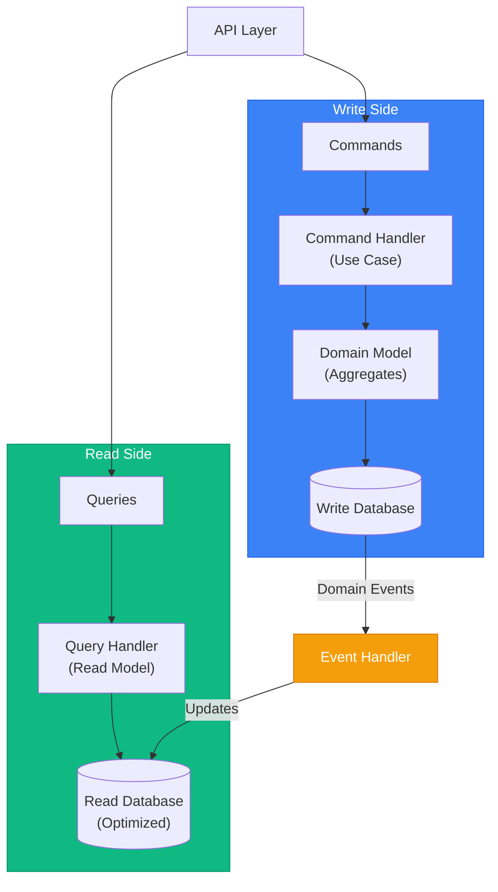

# CQRS & Domain Events

> Sources:
> - https://learn.microsoft.com/en-us/azure/architecture/patterns/cqrs
> - https://microservices.io/patterns/data/event-sourcing.html
> - https://martinfowler.com/bliki/CQRS.html

## CQRS Overview

**Command Query Responsibility Segregation** separates read and write operations into different models.



---

## Commands vs Queries

### Commands (Write Side)

Commands represent intent to change state. They **mutate** data.

```typescript
// application/commands/place_order_command.ts
export interface PlaceOrderCommand {
  type: 'PlaceOrder';
  customerId: string;
  items: Array<{
    productId: string;
    quantity: number;
  }>;
}

export interface ConfirmOrderCommand {
  type: 'ConfirmOrder';
  orderId: string;
}

export interface CancelOrderCommand {
  type: 'CancelOrder';
  orderId: string;
  reason: string;
}

// Command handler
export class PlaceOrderHandler {
  async handle(command: PlaceOrderCommand): Promise<OrderId> {
    // 1. Load/create aggregate
    const order = Order.create(CustomerId.from(command.customerId));

    // 2. Execute business logic
    for (const item of command.items) {
      const product = await this.productRepo.findById(item.productId);
      order.addItem(product.id, item.quantity, product.price);
    }

    // 3. Persist aggregate
    await this.orderRepo.save(order);

    // 4. Publish domain events
    await this.eventPublisher.publishAll(order.domainEvents);

    return order.id;
  }
}
```

### Queries (Read Side)

Queries retrieve data without side effects. They **never mutate** state.

```typescript
// application/queries/get_order_query.ts
export interface GetOrderQuery {
  orderId: string;
}

export interface GetOrdersByCustomerQuery {
  customerId: string;
  status?: OrderStatus;
  page?: number;
  pageSize?: number;
}

// Query result (DTO, not domain object)
export interface OrderDTO {
  id: string;
  customerId: string;
  customerName: string;  // Denormalized for read
  status: string;
  items: Array<{
    productId: string;
    productName: string;  // Denormalized
    quantity: number;
    unitPrice: number;
    subtotal: number;
  }>;
  total: number;
  createdAt: string;
  confirmedAt?: string;
}

// Query handler (bypasses domain model)
export class GetOrderHandler {
  constructor(private readonly readDb: IOrderReadModel) {}

  async handle(query: GetOrderQuery): Promise<OrderDTO | null> {
    // Query optimized read model directly
    return this.readDb.findById(query.orderId);
  }
}

export class GetOrdersByCustomerHandler {
  constructor(private readonly readDb: IOrderReadModel) {}

  async handle(query: GetOrdersByCustomerQuery): Promise<PaginatedResult<OrderDTO>> {
    return this.readDb.findByCustomer(
      query.customerId,
      query.status,
      query.page ?? 1,
      query.pageSize ?? 20
    );
  }
}
```

---

## Read Model (Projection)

Optimized database structure for queries. Can denormalize data for performance.

```typescript
// infrastructure/read_models/order_read_model.ts
export interface IOrderReadModel {
  findById(orderId: string): Promise<OrderDTO | null>;
  findByCustomer(
    customerId: string,
    status?: OrderStatus,
    page?: number,
    pageSize?: number
  ): Promise<PaginatedResult<OrderDTO>>;
  search(criteria: OrderSearchCriteria): Promise<OrderDTO[]>;
}

export class PostgresOrderReadModel implements IOrderReadModel {
  constructor(private readonly pool: Pool) {}

  async findById(orderId: string): Promise<OrderDTO | null> {
    // Optimized query joining all needed data
    const result = await this.pool.query(`
      SELECT
        o.id,
        o.status,
        o.total,
        o.created_at,
        o.confirmed_at,
        c.id as customer_id,
        c.name as customer_name,
        json_agg(json_build_object(
          'productId', oi.product_id,
          'productName', p.name,
          'quantity', oi.quantity,
          'unitPrice', oi.unit_price,
          'subtotal', oi.quantity * oi.unit_price
        )) as items
      FROM orders_read o
      JOIN customers c ON o.customer_id = c.id
      LEFT JOIN order_items_read oi ON o.id = oi.order_id
      LEFT JOIN products p ON oi.product_id = p.id
      WHERE o.id = $1
      GROUP BY o.id, c.id
    `, [orderId]);

    return result.rows[0] ? this.mapToDTO(result.rows[0]) : null;
  }
}

// Separate write and read databases (optional)
// Write: Normalized, optimized for transactions
// Read: Denormalized, optimized for queries
```

---

## Domain Events

Notifications that something happened in the domain. Used for:
- Updating read models
- Cross-aggregate communication
- Integration with other bounded contexts

### Event Structure

```typescript
// domain/shared/domain_event.ts
export abstract class DomainEvent {
  readonly eventId: string;
  readonly occurredAt: Date;
  readonly aggregateId: string;
  abstract readonly eventType: string;

  constructor(aggregateId: string) {
    this.eventId = crypto.randomUUID();
    this.occurredAt = new Date();
    this.aggregateId = aggregateId;
  }

  abstract toPayload(): Record<string, unknown>;
}

// domain/order/events.ts
export class OrderCreated extends DomainEvent {
  readonly eventType = 'order.created';

  constructor(
    readonly orderId: OrderId,
    readonly customerId: CustomerId,
  ) {
    super(orderId.value);
  }

  toPayload() {
    return {
      orderId: this.orderId.value,
      customerId: this.customerId.value,
    };
  }
}

export class OrderConfirmed extends DomainEvent {
  readonly eventType = 'order.confirmed';

  constructor(
    readonly orderId: OrderId,
    readonly total: Money,
    readonly items: ReadonlyArray<{ productId: string; quantity: number }>,
  ) {
    super(orderId.value);
  }

  toPayload() {
    return {
      orderId: this.orderId.value,
      total: { amount: this.total.amount, currency: this.total.currency },
      items: this.items,
    };
  }
}

export class OrderShipped extends DomainEvent {
  readonly eventType = 'order.shipped';

  constructor(
    readonly orderId: OrderId,
    readonly trackingNumber: string,
    readonly carrier: string,
  ) {
    super(orderId.value);
  }

  toPayload() {
    return {
      orderId: this.orderId.value,
      trackingNumber: this.trackingNumber,
      carrier: this.carrier,
    };
  }
}
```

### Event Handlers

```typescript
// application/event_handlers/order_event_handlers.ts

// Update read model when order is created
export class OrderCreatedHandler {
  constructor(private readonly readDb: Pool) {}

  async handle(event: OrderCreated): Promise<void> {
    await this.readDb.query(`
      INSERT INTO orders_read (id, customer_id, status, created_at)
      VALUES ($1, $2, 'draft', $3)
    `, [event.orderId.value, event.customerId.value, event.occurredAt]);
  }
}

// Update read model when order is confirmed
export class OrderConfirmedHandler {
  constructor(private readonly readDb: Pool) {}

  async handle(event: OrderConfirmed): Promise<void> {
    await this.readDb.query(`
      UPDATE orders_read
      SET status = 'confirmed', total = $2, confirmed_at = $3
      WHERE id = $1
    `, [event.orderId.value, event.total.amount, event.occurredAt]);
  }
}

// Send notification when order ships
export class SendShippingNotificationHandler {
  constructor(
    private readonly orderRepo: IOrderRepository,
    private readonly notifier: INotificationService,
  ) {}

  async handle(event: OrderShipped): Promise<void> {
    const order = await this.orderRepo.findById(OrderId.from(event.orderId.value));
    if (!order) return;

    await this.notifier.sendEmail(order.customerEmail, {
      template: 'order-shipped',
      data: {
        orderId: event.orderId.value,
        trackingNumber: event.trackingNumber,
        carrier: event.carrier,
      },
    });
  }
}
```

---

## Domain Events vs Integration Events

### Domain Events

- Stay within bounded context
- Fine-grained, low-level
- Trigger internal processes
- Named in domain language

```typescript
// Within Order bounded context
class OrderItemQuantityIncreased extends DomainEvent {
  constructor(
    readonly orderId: OrderId,
    readonly productId: ProductId,
    readonly oldQuantity: number,
    readonly newQuantity: number,
  ) { super(orderId.value); }
}
```

### Integration Events

- Cross bounded context boundaries
- Coarser-grained
- Published to message broker
- Versioned schema

```typescript
// Published to other bounded contexts
interface OrderConfirmedIntegrationEvent {
  eventType: 'sales.order.confirmed';
  eventId: string;
  version: '1.0';
  occurredAt: string;
  payload: {
    orderId: string;
    customerId: string;
    total: { amount: number; currency: string };
    items: Array<{
      productId: string;
      quantity: number;
      unitPrice: number;
    }>;
    shippingAddress: {
      street: string;
      city: string;
      postalCode: string;
      country: string;
    };
  };
}
```

### Publishing Integration Events

```typescript
// application/event_handlers/publish_integration_events.ts
export class PublishOrderConfirmedIntegrationEvent {
  constructor(
    private readonly messageBroker: IMessageBroker,
    private readonly orderRepo: IOrderRepository,
  ) {}

  async handle(domainEvent: OrderConfirmed): Promise<void> {
    const order = await this.orderRepo.findById(domainEvent.orderId);
    if (!order) return;

    // Map domain event to integration event
    const integrationEvent: OrderConfirmedIntegrationEvent = {
      eventType: 'sales.order.confirmed',
      eventId: crypto.randomUUID(),
      version: '1.0',
      occurredAt: new Date().toISOString(),
      payload: {
        orderId: order.id.value,
        customerId: order.customerId.value,
        total: {
          amount: order.total.amount,
          currency: order.total.currency,
        },
        items: order.items.map(item => ({
          productId: item.productId.value,
          quantity: item.quantity.value,
          unitPrice: item.unitPrice.amount,
        })),
        shippingAddress: order.shippingAddress
          ? {
              street: order.shippingAddress.street,
              city: order.shippingAddress.city,
              postalCode: order.shippingAddress.postalCode,
              country: order.shippingAddress.country,
            }
          : null,
      },
    };

    await this.messageBroker.publish('order-events', integrationEvent);
  }
}
```

---

## Event Dispatcher Pattern

```typescript
// infrastructure/events/event_dispatcher.ts
export interface IEventHandler<T extends DomainEvent> {
  handle(event: T): Promise<void>;
}

export class EventDispatcher {
  private handlers: Map<string, IEventHandler<any>[]> = new Map();

  register<T extends DomainEvent>(
    eventType: string,
    handler: IEventHandler<T>,
  ): void {
    const existing = this.handlers.get(eventType) ?? [];
    existing.push(handler);
    this.handlers.set(eventType, existing);
  }

  async dispatch(event: DomainEvent): Promise<void> {
    const handlers = this.handlers.get(event.eventType) ?? [];
    await Promise.all(handlers.map(h => h.handle(event)));
  }

  async dispatchAll(events: DomainEvent[]): Promise<void> {
    for (const event of events) {
      await this.dispatch(event);
    }
  }
}

// Setup
const dispatcher = new EventDispatcher();
dispatcher.register('order.created', new OrderCreatedHandler(readDb));
dispatcher.register('order.confirmed', new OrderConfirmedHandler(readDb));
dispatcher.register('order.confirmed', new PublishOrderConfirmedIntegrationEvent(broker, orderRepo));
dispatcher.register('order.shipped', new SendShippingNotificationHandler(orderRepo, notifier));
```

---

## Outbox Pattern

Ensures events are published reliably (exactly-once semantics).

```typescript
// infrastructure/persistence/outbox.ts
interface OutboxMessage {
  id: string;
  eventType: string;
  payload: string;
  createdAt: Date;
  processedAt: Date | null;
}

export class OutboxRepository {
  constructor(private readonly pool: Pool) {}

  async save(event: DomainEvent, tx: PoolClient): Promise<void> {
    await tx.query(`
      INSERT INTO outbox (id, event_type, payload, created_at)
      VALUES ($1, $2, $3, $4)
    `, [
      event.eventId,
      event.eventType,
      JSON.stringify(event.toPayload()),
      event.occurredAt,
    ]);
  }

  async getUnprocessed(limit: number = 100): Promise<OutboxMessage[]> {
    const result = await this.pool.query(`
      SELECT * FROM outbox
      WHERE processed_at IS NULL
      ORDER BY created_at
      LIMIT $1
      FOR UPDATE SKIP LOCKED
    `, [limit]);
    return result.rows;
  }

  async markProcessed(id: string): Promise<void> {
    await this.pool.query(`
      UPDATE outbox SET processed_at = NOW() WHERE id = $1
    `, [id]);
  }
}

// Command handler with outbox
export class PlaceOrderHandler {
  async handle(command: PlaceOrderCommand): Promise<OrderId> {
    const order = Order.create(CustomerId.from(command.customerId));
    // ... add items ...

    // Save aggregate AND events in same transaction
    await this.pool.transaction(async (tx) => {
      await this.orderRepo.save(order, tx);

      // Save events to outbox (same transaction)
      for (const event of order.domainEvents) {
        await this.outbox.save(event, tx);
      }
    });

    return order.id;
  }
}

// Background worker publishes from outbox
export class OutboxProcessor {
  async process(): Promise<void> {
    const messages = await this.outbox.getUnprocessed();

    for (const message of messages) {
      try {
        await this.messageBroker.publish(message.eventType, message.payload);
        await this.outbox.markProcessed(message.id);
      } catch (error) {
        // Will retry on next iteration
        console.error(`Failed to process outbox message ${message.id}`, error);
      }
    }
  }
}
```

---

## When to Use CQRS

### Use CQRS When:

- Read and write workloads have different scaling requirements
- Complex queries that don't map well to domain model
- Different teams work on read vs write
- Event sourcing is used
- Performance optimization needed for reads

### Skip CQRS When:

- Simple CRUD application
- Read/write patterns are similar
- Small team, simple domain
- Adding unnecessary complexity

### Simplified CQRS

Start simple—same database, different query paths:

```typescript
// Same database, but separate query path
class OrderService {
  // Write (through domain)
  async placeOrder(cmd: PlaceOrderCommand): Promise<OrderId> {
    const order = Order.create(...);
    await this.orderRepo.save(order);
    return order.id;
  }

  // Read (bypass domain, query directly)
  async getOrder(id: string): Promise<OrderDTO | null> {
    return this.readModel.findById(id);
  }
}
```

Evolve to separate databases only when needed.
