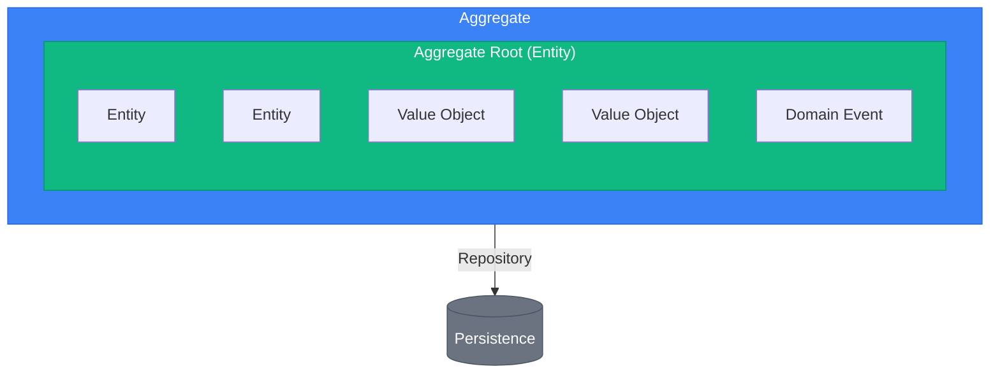
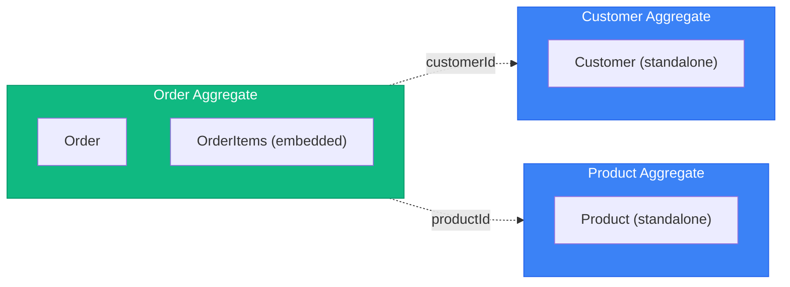
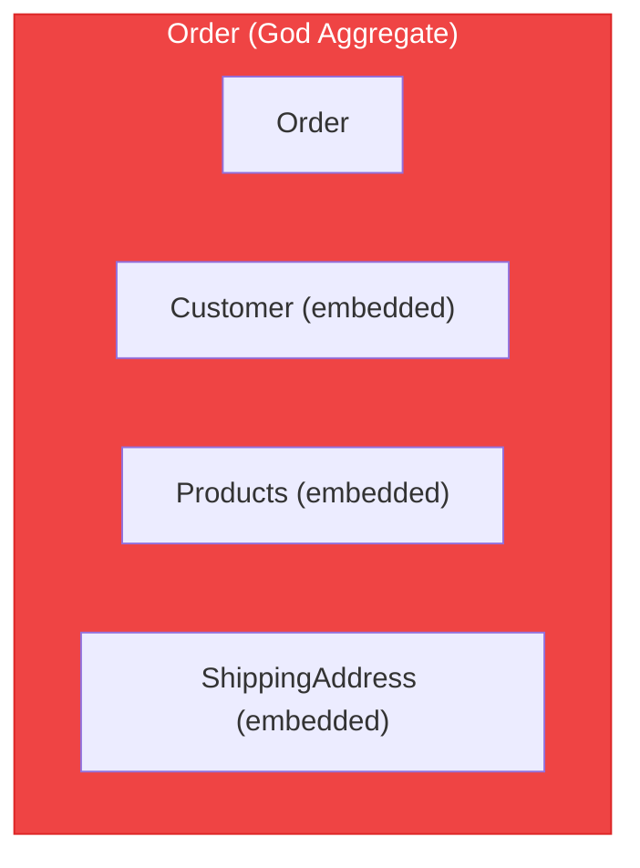

# DDD Tactical Patterns

> Sources:
> - Domain-Driven Design (Eric Evans, 2003)
> - Implementing Domain-Driven Design (Vaughn Vernon, 2013)
> - https://learn.microsoft.com/en-us/dotnet/architecture/microservices/microservice-ddd-cqrs-patterns/

## Building Blocks Overview



---

## Entity

An object with **identity** that persists through time. Two entities are equal if they have the same identity, regardless of attribute values.

### Characteristics

- Has a unique identifier
- Identity persists through lifecycle
- Can change attributes but remains the same entity
- Contains behavior (not just data)

### Implementation

```typescript
// domain/shared/entity.ts
export abstract class Entity<T> {
  protected readonly _id: T;

  protected constructor(id: T) {
    this._id = id;
  }

  get id(): T {
    return this._id;
  }

  equals(other: Entity<T>): boolean {
    if (other === null || other === undefined) {
      return false;
    }
    if (!(other instanceof Entity)) {
      return false;
    }
    return this._id === other._id;
  }
}

// domain/order/order_item.ts
export class OrderItem extends Entity<OrderItemId> {
  private _productId: ProductId;
  private _quantity: Quantity;
  private _unitPrice: Money;

  private constructor(
    id: OrderItemId,
    productId: ProductId,
    quantity: Quantity,
    unitPrice: Money,
  ) {
    super(id);
    this._productId = productId;
    this._quantity = quantity;
    this._unitPrice = unitPrice;
  }

  static create(
    productId: ProductId,
    quantity: Quantity,
    unitPrice: Money,
  ): OrderItem {
    return new OrderItem(
      OrderItemId.generate(),
      productId,
      quantity,
      unitPrice,
    );
  }

  increaseQuantity(amount: number): void {
    this._quantity = this._quantity.add(amount);
  }

  get subtotal(): Money {
    return this._unitPrice.multiply(this._quantity.value);
  }

  get productId(): ProductId { return this._productId; }
  get quantity(): Quantity { return this._quantity; }
  get unitPrice(): Money { return this._unitPrice; }
}
```

---

## Value Object

An object defined by its **attributes**, not identity. Two value objects are equal if all their attributes are equal.

### Characteristics

- Immutable (no setters)
- No identity
- Equality by value (all attributes)
- Self-validating
- Side-effect-free methods

### Common Value Objects

| Value Object | Attributes | Validation |
|--------------|-----------|------------|
| Money | amount, currency | amount >= 0 |
| Email | address | valid email format |
| Address | street, city, zip, country | required fields |
| DateRange | start, end | start <= end |
| Quantity | value | value > 0 |
| PhoneNumber | countryCode, number | valid format |

### Implementation

```typescript
// domain/shared/value_object.ts
export abstract class ValueObject<T> {
  protected readonly props: T;

  protected constructor(props: T) {
    this.props = Object.freeze(props);
  }

  equals(other: ValueObject<T>): boolean {
    if (other === null || other === undefined) {
      return false;
    }
    return JSON.stringify(this.props) === JSON.stringify(other.props);
  }
}

// domain/shared/money.ts
interface MoneyProps {
  amount: number;
  currency: string;
}

export class Money extends ValueObject<MoneyProps> {
  private constructor(props: MoneyProps) {
    super(props);
  }

  static create(amount: number, currency: string): Money {
    if (amount < 0) {
      throw new InvalidMoneyError('Amount cannot be negative');
    }
    if (!['USD', 'EUR', 'GBP'].includes(currency)) {
      throw new InvalidMoneyError(`Unsupported currency: ${currency}`);
    }
    return new Money({ amount, currency });
  }

  static zero(currency: string = 'USD'): Money {
    return new Money({ amount: 0, currency });
  }

  static fromCents(cents: number, currency: string): Money {
    return Money.create(cents / 100, currency);
  }

  add(other: Money): Money {
    this.assertSameCurrency(other);
    return Money.create(this.amount + other.amount, this.currency);
  }

  subtract(other: Money): Money {
    this.assertSameCurrency(other);
    return Money.create(this.amount - other.amount, this.currency);
  }

  multiply(factor: number): Money {
    return Money.create(this.amount * factor, this.currency);
  }

  private assertSameCurrency(other: Money): void {
    if (this.currency !== other.currency) {
      throw new CurrencyMismatchError(this.currency, other.currency);
    }
  }

  get amount(): number { return this.props.amount; }
  get currency(): string { return this.props.currency; }
  get cents(): number { return Math.round(this.amount * 100); }
}

// domain/shared/email.ts
interface EmailProps {
  value: string;
}

export class Email extends ValueObject<EmailProps> {
  private static readonly EMAIL_REGEX = /^[^\s@]+@[^\s@]+\.[^\s@]+$/;

  private constructor(props: EmailProps) {
    super(props);
  }

  static create(email: string): Email {
    const normalized = email.toLowerCase().trim();
    if (!Email.EMAIL_REGEX.test(normalized)) {
      throw new InvalidEmailError(email);
    }
    return new Email({ value: normalized });
  }

  get value(): string { return this.props.value; }
  get domain(): string { return this.value.split('@')[1]; }
}

// domain/order/value_objects.ts
export class OrderId extends ValueObject<{ value: string }> {
  private constructor(value: string) {
    super({ value });
  }

  static generate(): OrderId {
    return new OrderId(crypto.randomUUID());
  }

  static from(value: string): OrderId {
    if (!value || value.trim() === '') {
      throw new InvalidOrderIdError('Order ID cannot be empty');
    }
    return new OrderId(value);
  }

  get value(): string { return this.props.value; }
}

export enum OrderStatus {
  Draft = 'draft',
  Pending = 'pending',
  Confirmed = 'confirmed',
  Shipped = 'shipped',
  Delivered = 'delivered',
  Cancelled = 'cancelled',
}
```

---

## Aggregate

A cluster of entities and value objects treated as a single unit for data changes. Has a **consistency boundary**.

### Rules

1. **One aggregate root** - Single entry point for all modifications
2. **Reference by ID** - Aggregates reference others only by identity
3. **Transaction boundary** - One aggregate per transaction
4. **Invariants within boundary** - Aggregate ensures its own consistency
5. **Small aggregates** - Prefer smaller over larger

### Design Guidelines

**Good: Small Aggregates**



*Reference by ID only*

**Bad: God Aggregate**



*❌ Too large, too many reasons to change, contention issues*

### Implementation

```typescript
// domain/shared/aggregate_root.ts
export abstract class AggregateRoot<T> extends Entity<T> {
  private _domainEvents: DomainEvent[] = [];
  private _version: number = 0;

  protected addDomainEvent(event: DomainEvent): void {
    this._domainEvents.push(event);
  }

  get domainEvents(): ReadonlyArray<DomainEvent> {
    return this._domainEvents;
  }

  clearDomainEvents(): void {
    this._domainEvents = [];
  }

  get version(): number {
    return this._version;
  }

  incrementVersion(): void {
    this._version++;
  }
}

// domain/order/order.ts
export class Order extends AggregateRoot<OrderId> {
  private _customerId: CustomerId;
  private _items: OrderItem[] = [];
  private _status: OrderStatus;
  private _shippingAddress: Address | null = null;
  private _createdAt: Date;
  private _confirmedAt: Date | null = null;

  private constructor(id: OrderId, customerId: CustomerId) {
    super(id);
    this._customerId = customerId;
    this._status = OrderStatus.Draft;
    this._createdAt = new Date();
  }

  // Factory method - single entry point for creation
  static create(customerId: CustomerId): Order {
    const order = new Order(OrderId.generate(), customerId);
    order.addDomainEvent(new OrderCreated(order.id, customerId));
    return order;
  }

  // Reconstitution from persistence (no events)
  static reconstitute(
    id: OrderId,
    customerId: CustomerId,
    items: OrderItem[],
    status: OrderStatus,
    shippingAddress: Address | null,
    createdAt: Date,
    confirmedAt: Date | null,
    version: number,
  ): Order {
    const order = new Order(id, customerId);
    order._items = items;
    order._status = status;
    order._shippingAddress = shippingAddress;
    order._createdAt = createdAt;
    order._confirmedAt = confirmedAt;
    order._version = version;
    return order;
  }

  // Business operations with invariant enforcement
  addItem(productId: ProductId, quantity: Quantity, unitPrice: Money): void {
    this.assertNotCancelled();
    this.assertNotShipped();

    const existingItem = this._items.find(i => i.productId.equals(productId));
    if (existingItem) {
      existingItem.increaseQuantity(quantity.value);
    } else {
      this._items.push(OrderItem.create(productId, quantity, unitPrice));
    }

    this.addDomainEvent(new OrderItemAdded(this.id, productId, quantity));
  }

  removeItem(productId: ProductId): void {
    this.assertNotCancelled();
    this.assertNotShipped();

    const index = this._items.findIndex(i => i.productId.equals(productId));
    if (index === -1) {
      throw new OrderItemNotFoundError(this.id, productId);
    }

    this._items.splice(index, 1);
    this.addDomainEvent(new OrderItemRemoved(this.id, productId));
  }

  setShippingAddress(address: Address): void {
    this.assertNotCancelled();
    this.assertNotShipped();
    this._shippingAddress = address;
  }

  confirm(): void {
    this.assertNotCancelled();
    if (this._status !== OrderStatus.Draft) {
      throw new InvalidOrderStateError('Can only confirm draft orders');
    }
    if (this._items.length === 0) {
      throw new EmptyOrderError('Cannot confirm empty order');
    }
    if (!this._shippingAddress) {
      throw new MissingShippingAddressError();
    }

    this._status = OrderStatus.Confirmed;
    this._confirmedAt = new Date();
    this.addDomainEvent(new OrderConfirmed(this.id, this.total));
  }

  ship(trackingNumber: TrackingNumber): void {
    if (this._status !== OrderStatus.Confirmed) {
      throw new InvalidOrderStateError('Can only ship confirmed orders');
    }

    this._status = OrderStatus.Shipped;
    this.addDomainEvent(new OrderShipped(this.id, trackingNumber));
  }

  cancel(reason: string): void {
    if (this._status === OrderStatus.Shipped || this._status === OrderStatus.Delivered) {
      throw new InvalidOrderStateError('Cannot cancel shipped/delivered orders');
    }

    this._status = OrderStatus.Cancelled;
    this.addDomainEvent(new OrderCancelled(this.id, reason));
  }

  // Invariant guards
  private assertNotCancelled(): void {
    if (this._status === OrderStatus.Cancelled) {
      throw new InvalidOrderStateError('Order is cancelled');
    }
  }

  private assertNotShipped(): void {
    if (this._status === OrderStatus.Shipped || this._status === OrderStatus.Delivered) {
      throw new InvalidOrderStateError('Order is already shipped');
    }
  }

  // Computed properties
  get total(): Money {
    return this._items.reduce(
      (sum, item) => sum.add(item.subtotal),
      Money.zero()
    );
  }

  get itemCount(): number {
    return this._items.reduce((sum, item) => sum + item.quantity.value, 0);
  }

  // Getters (read-only access)
  get customerId(): CustomerId { return this._customerId; }
  get items(): ReadonlyArray<OrderItem> { return this._items; }
  get status(): OrderStatus { return this._status; }
  get shippingAddress(): Address | null { return this._shippingAddress; }
  get createdAt(): Date { return this._createdAt; }
  get confirmedAt(): Date | null { return this._confirmedAt; }
}
```

---

## Repository

Provides collection-like access to aggregates. Abstracts persistence.

### Rules

1. **One repository per aggregate** - Not per entity or table
2. **Domain interface** - Interface in domain, implementation in infrastructure
3. **Aggregate-focused** - Save/load entire aggregates
4. **No query logic** - Complex queries belong in separate read models

### Interface Design

```typescript
// domain/order/repository.ts
export interface IOrderRepository {
  // Retrieval
  findById(id: OrderId): Promise<Order | null>;
  findByCustomerId(customerId: CustomerId): Promise<Order[]>;

  // Persistence
  save(order: Order): Promise<void>;
  delete(order: Order): Promise<void>;

  // Identity generation (optional)
  nextId(): OrderId;
}

// domain/shared/repository.ts
export interface IRepository<T extends AggregateRoot<ID>, ID> {
  findById(id: ID): Promise<T | null>;
  save(aggregate: T): Promise<void>;
  delete(aggregate: T): Promise<void>;
}
```

### Common Mistakes

```typescript
// ❌ Wrong: Repository per entity (not aggregate)
interface IOrderItemRepository {
  findByOrderId(orderId: OrderId): Promise<OrderItem[]>;
  save(item: OrderItem): Promise<void>;
}

// ❌ Wrong: Query methods that bypass aggregate
interface IOrderRepository {
  findByStatus(status: OrderStatus): Promise<Order[]>;
  findByDateRange(start: Date, end: Date): Promise<Order[]>;
  countByCustomer(customerId: CustomerId): Promise<number>;
}

// ✅ Correct: Aggregate-focused + separate read model
interface IOrderRepository {
  findById(id: OrderId): Promise<Order | null>;
  save(order: Order): Promise<void>;
}

// ✅ Complex queries in separate read model
interface IOrderReadModel {
  findByStatus(status: OrderStatus): Promise<OrderSummaryDTO[]>;
  findByDateRange(start: Date, end: Date): Promise<OrderSummaryDTO[]>;
  countByCustomer(customerId: CustomerId): Promise<number>;
}
```

---

## Domain Event

Records something significant that happened in the domain.

### Characteristics

- Immutable
- Past tense naming (`OrderPlaced`, not `PlaceOrder`)
- Contains data needed by consumers
- Timestamp when it occurred

### Implementation

```typescript
// domain/shared/domain_event.ts
export abstract class DomainEvent {
  readonly eventId: string;
  readonly occurredAt: Date;
  abstract readonly eventType: string;

  protected constructor() {
    this.eventId = crypto.randomUUID();
    this.occurredAt = new Date();
  }

  abstract toPayload(): Record<string, unknown>;
}

// domain/order/events.ts
export class OrderCreated extends DomainEvent {
  readonly eventType = 'order.created';

  constructor(
    readonly orderId: OrderId,
    readonly customerId: CustomerId,
  ) {
    super();
  }

  toPayload(): Record<string, unknown> {
    return {
      orderId: this.orderId.value,
      customerId: this.customerId.value,
    };
  }
}

export class OrderConfirmed extends DomainEvent {
  readonly eventType = 'order.confirmed';

  constructor(
    readonly orderId: OrderId,
    readonly total: Money,
  ) {
    super();
  }

  toPayload(): Record<string, unknown> {
    return {
      orderId: this.orderId.value,
      total: {
        amount: this.total.amount,
        currency: this.total.currency,
      },
    };
  }
}

export class OrderShipped extends DomainEvent {
  readonly eventType = 'order.shipped';

  constructor(
    readonly orderId: OrderId,
    readonly trackingNumber: TrackingNumber,
  ) {
    super();
  }

  toPayload(): Record<string, unknown> {
    return {
      orderId: this.orderId.value,
      trackingNumber: this.trackingNumber.value,
    };
  }
}
```

---

## Domain Service

Stateless operations that don't naturally fit within an entity or value object.

### When to Use

- Operation involves multiple aggregates
- Operation requires external information
- Significant business logic that doesn't belong to one entity

### Implementation

```typescript
// domain/order/services/pricing_service.ts
export interface IPricingService {
  calculateDiscount(order: Order, customer: Customer): Money;
}

export class PricingService implements IPricingService {
  calculateDiscount(order: Order, customer: Customer): Money {
    let discount = Money.zero();

    // Volume discount
    if (order.itemCount > 10) {
      discount = discount.add(order.total.multiply(0.05));
    }

    // Loyalty discount
    if (customer.isVIP) {
      discount = discount.add(order.total.multiply(0.10));
    }

    // Cap at 20%
    const maxDiscount = order.total.multiply(0.20);
    return discount.amount > maxDiscount.amount ? maxDiscount : discount;
  }
}

// domain/shipping/services/shipping_cost_calculator.ts
export interface IShippingCostCalculator {
  calculate(items: ReadonlyArray<OrderItem>, destination: Address): Money;
}

export class ShippingCostCalculator implements IShippingCostCalculator {
  calculate(items: ReadonlyArray<OrderItem>, destination: Address): Money {
    const baseRate = Money.create(5.99, 'USD');
    const perItemRate = Money.create(1.50, 'USD');

    const itemCost = perItemRate.multiply(items.length);
    let total = baseRate.add(itemCost);

    // International shipping surcharge
    if (destination.country !== 'US') {
      total = total.add(Money.create(15.00, 'USD'));
    }

    return total;
  }
}
```

---

## Factory

Encapsulates complex aggregate/entity creation.

### When to Use

- Creation logic is complex
- Need to enforce invariants during creation
- Need to create object graphs

### Implementation

```typescript
// domain/order/order_factory.ts
export interface IOrderFactory {
  createFromCart(cart: Cart, customer: Customer): Order;
}

export class OrderFactory implements IOrderFactory {
  constructor(
    private readonly pricingService: IPricingService,
  ) {}

  createFromCart(cart: Cart, customer: Customer): Order {
    if (cart.isEmpty) {
      throw new EmptyCartError();
    }

    const order = Order.create(customer.id);

    for (const cartItem of cart.items) {
      order.addItem(
        cartItem.productId,
        Quantity.create(cartItem.quantity),
        cartItem.unitPrice,
      );
    }

    if (customer.defaultAddress) {
      order.setShippingAddress(customer.defaultAddress);
    }

    return order;
  }
}
```

---

## Specification Pattern

Encapsulates business rules for querying or validation.

```typescript
// domain/shared/specification.ts
export interface ISpecification<T> {
  isSatisfiedBy(candidate: T): boolean;
  and(other: ISpecification<T>): ISpecification<T>;
  or(other: ISpecification<T>): ISpecification<T>;
  not(): ISpecification<T>;
}

export abstract class Specification<T> implements ISpecification<T> {
  abstract isSatisfiedBy(candidate: T): boolean;

  and(other: ISpecification<T>): ISpecification<T> {
    return new AndSpecification(this, other);
  }

  or(other: ISpecification<T>): ISpecification<T> {
    return new OrSpecification(this, other);
  }

  not(): ISpecification<T> {
    return new NotSpecification(this);
  }
}

// domain/order/specifications.ts
export class OrderOverValueSpec extends Specification<Order> {
  constructor(private readonly minValue: Money) {}

  isSatisfiedBy(order: Order): boolean {
    return order.total.amount >= this.minValue.amount;
  }
}

export class OrderHasItemsSpec extends Specification<Order> {
  isSatisfiedBy(order: Order): boolean {
    return order.items.length > 0;
  }
}

// Usage
const canShipFree = new OrderOverValueSpec(Money.create(100, 'USD'))
  .and(new OrderHasItemsSpec());

if (canShipFree.isSatisfiedBy(order)) {
  // Apply free shipping
}
```
