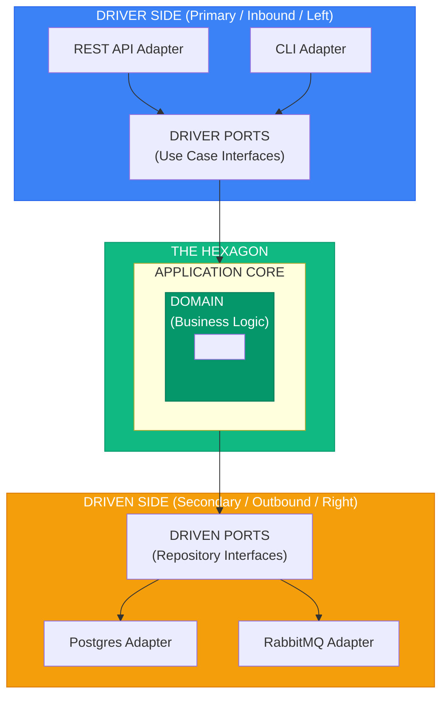
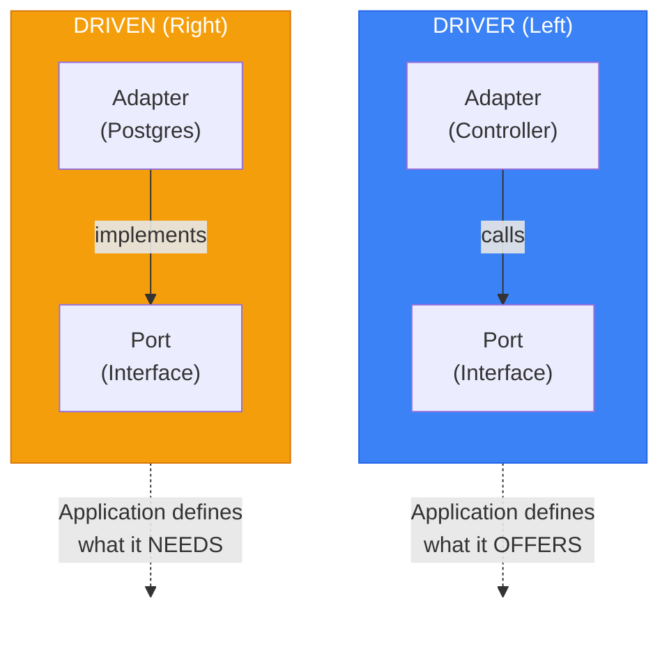

# Hexagonal Architecture (Ports & Adapters)

> Sources:
> - https://alistair.cockburn.us/hexagonal-architecture/
> - Hexagonal Architecture Explained (Alistair Cockburn & Juan Manuel Garrido, 2024)
> - https://jmgarridopaz.github.io/content/hexagonalarchitecture.html

## Core Concept

> "Allow an application to equally be driven by users, programs, automated tests, or batch scripts, and to be developed and tested in isolation from its eventual run-time devices and databases."
> — Alistair Cockburn



---

## Ports

Interfaces defining how the application communicates with the outside world.

### Driver Ports (Primary / Inbound)

Define **how the world uses your application**.

- Entry points to the application
- Called by adapters
- Represent use cases

```typescript
// application/ports/driver/place_order_port.ts
export interface IPlaceOrderPort {
  execute(command: PlaceOrderCommand): Promise<OrderId>;
}

// application/ports/driver/get_order_port.ts
export interface IGetOrderPort {
  execute(query: GetOrderQuery): Promise<OrderDTO | null>;
}

// application/ports/driver/cancel_order_port.ts
export interface ICancelOrderPort {
  execute(command: CancelOrderCommand): Promise<void>;
}
```

### Driven Ports (Secondary / Outbound)

Define **how your application uses external systems**.

- Dependencies the application needs
- Implemented by adapters
- Application calls these interfaces

```typescript
// application/ports/driven/order_repository_port.ts
export interface IOrderRepositoryPort {
  findById(id: OrderId): Promise<Order | null>;
  save(order: Order): Promise<void>;
  delete(order: Order): Promise<void>;
}

// application/ports/driven/event_publisher_port.ts
export interface IEventPublisherPort {
  publish(event: DomainEvent): Promise<void>;
  publishAll(events: DomainEvent[]): Promise<void>;
}

// application/ports/driven/payment_gateway_port.ts
export interface IPaymentGatewayPort {
  charge(amount: Money, paymentMethod: PaymentMethod): Promise<PaymentResult>;
  refund(paymentId: PaymentId, amount: Money): Promise<RefundResult>;
}

// application/ports/driven/notification_port.ts
export interface INotificationPort {
  sendEmail(to: Email, template: EmailTemplate): Promise<void>;
  sendSMS(to: PhoneNumber, message: string): Promise<void>;
}
```

---

## Adapters

Concrete implementations that connect ports to external technologies.

### Driver Adapters (Primary / Inbound)

Convert external inputs to port calls.

```typescript
// infrastructure/adapters/driver/rest/order_controller.ts
import { Router, Request, Response } from 'express';
import { IPlaceOrderPort } from '@/application/ports/driver/place_order_port';
import { IGetOrderPort } from '@/application/ports/driver/get_order_port';

export class OrderController {
  constructor(
    private readonly placeOrder: IPlaceOrderPort,
    private readonly getOrder: IGetOrderPort,
  ) {}

  async create(req: Request, res: Response): Promise<void> {
    // Adapt HTTP request to port command
    const command: PlaceOrderCommand = {
      customerId: req.user.id,
      items: req.body.items.map((item: any) => ({
        productId: item.product_id,
        quantity: item.quantity,
      })),
    };

    const orderId = await this.placeOrder.execute(command);
    res.status(201).json({ id: orderId.value });
  }

  async show(req: Request, res: Response): Promise<void> {
    const order = await this.getOrder.execute({ orderId: req.params.id });

    if (!order) {
      res.status(404).json({ error: 'Order not found' });
      return;
    }

    res.json(order);
  }
}

// infrastructure/adapters/driver/grpc/order_service.ts
import { IPlaceOrderPort } from '@/application/ports/driver/place_order_port';
import { OrderServiceServer, PlaceOrderRequest, PlaceOrderResponse } from './generated/order_pb';

export class GrpcOrderService implements OrderServiceServer {
  constructor(private readonly placeOrder: IPlaceOrderPort) {}

  async placeOrder(
    request: PlaceOrderRequest,
  ): Promise<PlaceOrderResponse> {
    // Adapt gRPC request to port command
    const command: PlaceOrderCommand = {
      customerId: request.getCustomerId(),
      items: request.getItemsList().map(item => ({
        productId: item.getProductId(),
        quantity: item.getQuantity(),
      })),
    };

    const orderId = await this.placeOrder.execute(command);

    const response = new PlaceOrderResponse();
    response.setOrderId(orderId.value);
    return response;
  }
}

// infrastructure/adapters/driver/cli/place_order_command.ts
import { Command } from 'commander';
import { IPlaceOrderPort } from '@/application/ports/driver/place_order_port';

export function createPlaceOrderCommand(placeOrder: IPlaceOrderPort): Command {
  return new Command('place-order')
    .description('Place a new order')
    .requiredOption('-c, --customer <id>', 'Customer ID')
    .requiredOption('-p, --product <id>', 'Product ID')
    .requiredOption('-q, --quantity <number>', 'Quantity', parseInt)
    .action(async (options) => {
      const orderId = await placeOrder.execute({
        customerId: options.customer,
        items: [{ productId: options.product, quantity: options.quantity }],
      });

      console.log(`Order created: ${orderId.value}`);
    });
}

// infrastructure/adapters/driver/message/order_message_handler.ts
import { IPlaceOrderPort } from '@/application/ports/driver/place_order_port';

export class OrderMessageHandler {
  constructor(private readonly placeOrder: IPlaceOrderPort) {}

  async handlePlaceOrderMessage(message: PlaceOrderMessage): Promise<void> {
    // Adapt message to port command
    await this.placeOrder.execute({
      customerId: message.customerId,
      items: message.items,
    });
  }
}
```

### Driven Adapters (Secondary / Outbound)

Implement port interfaces using specific technologies.

```typescript
// infrastructure/adapters/driven/postgres/order_repository.ts
import { Pool } from 'pg';
import { IOrderRepositoryPort } from '@/application/ports/driven/order_repository_port';
import { Order } from '@/domain/order/order';
import { OrderMapper } from './mappers/order_mapper';

export class PostgresOrderRepository implements IOrderRepositoryPort {
  constructor(private readonly pool: Pool) {}

  async findById(id: OrderId): Promise<Order | null> {
    const result = await this.pool.query(
      'SELECT * FROM orders WHERE id = $1',
      [id.value]
    );

    if (result.rows.length === 0) return null;
    return OrderMapper.toDomain(result.rows[0]);
  }

  async save(order: Order): Promise<void> {
    const data = OrderMapper.toPersistence(order);
    await this.pool.query(
      `INSERT INTO orders (id, customer_id, status, total, created_at)
       VALUES ($1, $2, $3, $4, $5)
       ON CONFLICT (id) DO UPDATE SET
         status = EXCLUDED.status,
         total = EXCLUDED.total`,
      [data.id, data.customerId, data.status, data.total, data.createdAt]
    );
  }

  async delete(order: Order): Promise<void> {
    await this.pool.query('DELETE FROM orders WHERE id = $1', [order.id.value]);
  }
}

// infrastructure/adapters/driven/in_memory/order_repository.ts
import { IOrderRepositoryPort } from '@/application/ports/driven/order_repository_port';

export class InMemoryOrderRepository implements IOrderRepositoryPort {
  private orders: Map<string, Order> = new Map();

  async findById(id: OrderId): Promise<Order | null> {
    return this.orders.get(id.value) ?? null;
  }

  async save(order: Order): Promise<void> {
    this.orders.set(order.id.value, order);
  }

  async delete(order: Order): Promise<void> {
    this.orders.delete(order.id.value);
  }

  // Test helpers
  clear(): void {
    this.orders.clear();
  }

  getAll(): Order[] {
    return Array.from(this.orders.values());
  }
}

// infrastructure/adapters/driven/stripe/payment_gateway.ts
import Stripe from 'stripe';
import { IPaymentGatewayPort } from '@/application/ports/driven/payment_gateway_port';

export class StripePaymentGateway implements IPaymentGatewayPort {
  private readonly stripe: Stripe;

  constructor(apiKey: string) {
    this.stripe = new Stripe(apiKey);
  }

  async charge(amount: Money, paymentMethod: PaymentMethod): Promise<PaymentResult> {
    try {
      const paymentIntent = await this.stripe.paymentIntents.create({
        amount: amount.cents,
        currency: amount.currency.toLowerCase(),
        payment_method: paymentMethod.stripeId,
        confirm: true,
      });

      return PaymentResult.success(PaymentId.from(paymentIntent.id));
    } catch (error) {
      if (error instanceof Stripe.errors.StripeCardError) {
        return PaymentResult.failed(error.message);
      }
      throw error;
    }
  }

  async refund(paymentId: PaymentId, amount: Money): Promise<RefundResult> {
    const refund = await this.stripe.refunds.create({
      payment_intent: paymentId.value,
      amount: amount.cents,
    });

    return RefundResult.success(RefundId.from(refund.id));
  }
}

// infrastructure/adapters/driven/rabbitmq/event_publisher.ts
import { Channel, Connection } from 'amqplib';
import { IEventPublisherPort } from '@/application/ports/driven/event_publisher_port';

export class RabbitMQEventPublisher implements IEventPublisherPort {
  private channel: Channel | null = null;

  constructor(private readonly connection: Connection) {}

  async publish(event: DomainEvent): Promise<void> {
    const channel = await this.getChannel();
    const exchange = 'domain_events';
    const routingKey = event.eventType;

    await channel.assertExchange(exchange, 'topic', { durable: true });
    channel.publish(
      exchange,
      routingKey,
      Buffer.from(JSON.stringify({
        eventId: event.eventId,
        eventType: event.eventType,
        occurredAt: event.occurredAt.toISOString(),
        payload: event.toPayload(),
      })),
      { persistent: true }
    );
  }

  async publishAll(events: DomainEvent[]): Promise<void> {
    for (const event of events) {
      await this.publish(event);
    }
  }

  private async getChannel(): Promise<Channel> {
    if (!this.channel) {
      this.channel = await this.connection.createChannel();
    }
    return this.channel;
  }
}
```

---

## Naming Conventions

### Alistair Cockburn's Recommended Pattern

**Ports:** `For[Doing][Something]`
- Driver: `ForPlacingOrders`, `ForConfiguringSettings`
- Driven: `ForStoringUsers`, `ForNotifyingAlerts`

**Adapters:** Reference the technology
- `CliCommandForPlacingOrders`
- `MysqlDatabaseForStoringUsers`
- `SlackNotifierForAlerts`

### Alternative Patterns

| Pattern | Port | Adapter |
|---------|------|---------|
| Interface/Impl | `IOrderRepository` | `PostgresOrderRepository` |
| Port suffix | `OrderRepositoryPort` | `PostgresOrderAdapter` |
| Using prefix | `IOrderStorage` | `OrderStorageUsingPostgres` |

### Project Structure

```
src/
├── application/
│   ├── ports/
│   │   ├── driver/                    # Inbound ports
│   │   │   ├── place_order_port.ts
│   │   │   ├── get_order_port.ts
│   │   │   └── cancel_order_port.ts
│   │   └── driven/                    # Outbound ports
│   │       ├── order_repository_port.ts
│   │       ├── event_publisher_port.ts
│   │       └── payment_gateway_port.ts
│   └── use_cases/
│       ├── place_order/
│       │   └── handler.ts             # Implements driver port
│       └── get_order/
│           └── handler.ts
├── infrastructure/
│   └── adapters/
│       ├── driver/                    # Inbound adapters
│       │   ├── rest/
│       │   │   └── order_controller.ts
│       │   ├── grpc/
│       │   │   └── order_service.ts
│       │   └── cli/
│       │       └── commands.ts
│       └── driven/                    # Outbound adapters
│           ├── postgres/
│           │   └── order_repository.ts
│           ├── rabbitmq/
│           │   └── event_publisher.ts
│           ├── stripe/
│           │   └── payment_gateway.ts
│           └── in_memory/             # Test adapters
│               ├── order_repository.ts
│               └── event_publisher.ts
└── domain/
    └── ...
```

---

## Key Asymmetry



---

## Configurability via Adapters

The power of hexagonal architecture: swap adapters without changing the core.

```typescript
// infrastructure/config/container.ts

// Development configuration
function configureDevelopment(container: Container): void {
  // Use in-memory adapters for fast local development
  container.bind<IOrderRepositoryPort>('IOrderRepositoryPort')
    .to(InMemoryOrderRepository);
  container.bind<IEventPublisherPort>('IEventPublisherPort')
    .to(InMemoryEventPublisher);
  container.bind<IPaymentGatewayPort>('IPaymentGatewayPort')
    .to(FakePaymentGateway);
}

// Testing configuration
function configureTest(container: Container): void {
  // Use in-memory adapters with spy capabilities
  container.bind<IOrderRepositoryPort>('IOrderRepositoryPort')
    .to(InMemoryOrderRepository);
  container.bind<IEventPublisherPort>('IEventPublisherPort')
    .to(SpyEventPublisher);
  container.bind<IPaymentGatewayPort>('IPaymentGatewayPort')
    .to(MockPaymentGateway);
}

// Production configuration
function configureProduction(container: Container): void {
  // Use real adapters
  container.bind<IOrderRepositoryPort>('IOrderRepositoryPort')
    .to(PostgresOrderRepository);
  container.bind<IEventPublisherPort>('IEventPublisherPort')
    .to(RabbitMQEventPublisher);
  container.bind<IPaymentGatewayPort>('IPaymentGatewayPort')
    .to(StripePaymentGateway);
}

// Swap database without touching application code
function configureWithMongoDB(container: Container): void {
  container.bind<IOrderRepositoryPort>('IOrderRepositoryPort')
    .to(MongoDBOrderRepository);  // Just change this line
}
```

---

## Strong vs Weak Hexagonal

### Weak Implementation

Port is technology-aware (not truly abstract):

```typescript
// ❌ Weak: Leaks SQL concepts
interface IOrderRepository {
  findByQuery(sql: string, params: any[]): Promise<Order[]>;
}
```

### Strong Implementation

Port is fully technology-agnostic:

```typescript
// ✅ Strong: Pure domain concepts
interface IOrderRepository {
  findById(id: OrderId): Promise<Order | null>;
  findByCustomer(customerId: CustomerId): Promise<Order[]>;
  save(order: Order): Promise<void>;
}
```

---

## Benefits

1. **Testability** - Swap real adapters for test doubles
2. **Flexibility** - Change technologies without changing core
3. **Independence** - Develop core without external systems
4. **Clear boundaries** - Explicit interfaces between layers
5. **Parallel development** - Teams work on different adapters
