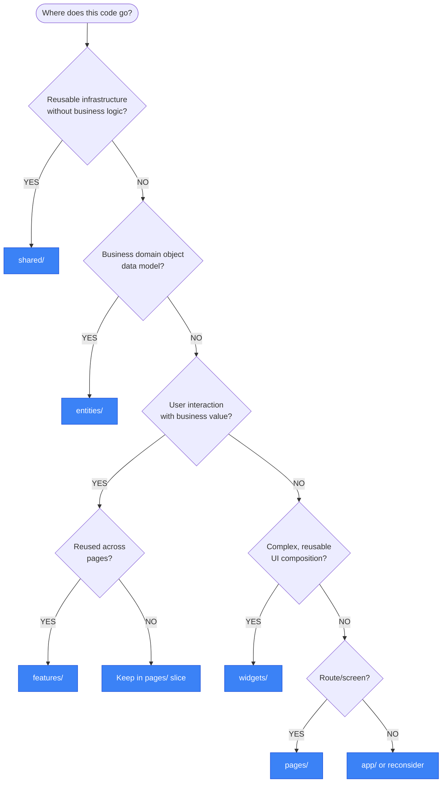

# FSD Layers - Complete Reference

> Source: https://feature-sliced.design/docs/reference/layers

## Layer Hierarchy

Arranged from highest to lowest responsibility and dependency:

| Layer | Purpose | Has Slices | Optional |
|-------|---------|------------|----------|
| `app/` | Application initialization, providers, routing | No | No |
| `processes/` | Cross-page workflows (DEPRECATED) | Yes | Yes |
| `pages/` | Route-based screens | Yes | No |
| `widgets/` | Complex reusable UI blocks | Yes | Yes |
| `features/` | User interactions with business value | Yes | Yes |
| `entities/` | Business domain models | Yes | Yes |
| `shared/` | Reusable infrastructure | No | No |

## The Import Rule

**Critical constraint:** A module can only import from layers strictly below it.

```
app/      → can import from: pages, widgets, features, entities, shared
pages/    → can import from: widgets, features, entities, shared
widgets/  → can import from: features, entities, shared
features/ → can import from: entities, shared
entities/ → can import from: shared
shared/   → can import from: external packages only
```

**Exception:** `app/` and `shared/` don't have slices, so internal cross-imports are allowed within them.

---

## Layer Details

### Shared Layer

The foundation layer establishing external connections and internal libraries **without business domain knowledge**.

**Typical segments:**

```
shared/
├── api/           # Backend client, request functions, interceptors
├── ui/            # Business-agnostic UI components (buttons, inputs, modals)
├── lib/           # Focused utilities (dates, colors, text, validation)
├── config/        # Environment variables, feature flags, constants
├── routes/        # Route path constants
├── i18n/          # Translation setup, language files
└── types/         # Global TypeScript types
```

**Guidelines:**
- Avoid generic names like `components/`, `hooks/`, `utils/`
- Use purpose-driven segment names
- No business logic or domain knowledge
- Should be extractable to a separate package

**Example - API Client:**

See: [API client example](../examples/shared/api-client.ts)

---

### Entities Layer

Represents real-world business concepts the application works with.

**Typical structure:**

```
entities/
├── user/
│   ├── ui/           # UserAvatar, UserCard, UserBadge
│   ├── api/          # getUser, updateUser
│   ├── model/        # User types, validation schemas, store
│   ├── lib/          # formatUserName, calculateUserAge
│   └── index.ts      # Public API
├── product/
│   ├── ui/           # ProductCard, ProductImage
│   ├── api/          # getProducts, getProductById
│   ├── model/        # Product types, schemas
│   └── index.ts
└── order/
    └── ...
```

**What belongs here:**
- Data models and TypeScript interfaces
- API functions for CRUD operations
- Reusable UI representations of entities
- Validation schemas (Zod, Yup)
- Entity-specific utilities

**What doesn't belong:**
- User interactions (features)
- Page layouts (pages)
- Complex composed UI (widgets)

**Cross-Entity References with `@x` Notation:**

When entities need to reference each other (e.g., Order references Product):

```
entities/
├── product/
│   ├── @x/
│   │   └── order.ts    # Special API for order entity
│   └── index.ts
└── order/
    └── model/
        └── types.ts    # imports from entities/product/@x/order
```

See [PUBLIC-API.md](PUBLIC-API.md#cross-imports-with-x-notation) for detailed @x notation patterns.

---

### Features Layer

Implements user-facing interactions that provide business value.

**Key principle:** Not everything needs to be a feature. Reserve this layer for reused interactions.

**Typical structure:**

```
features/
├── add-to-cart/
│   ├── ui/           # AddToCartButton, QuantitySelector
│   ├── api/          # addToCart mutation
│   ├── model/        # validation, local state
│   └── index.ts
├── auth/
│   ├── ui/           # LoginForm, LogoutButton
│   ├── api/          # login, logout, register
│   ├── model/        # auth state, session management
│   └── index.ts
└── search-products/
    ├── ui/           # SearchInput, SearchFilters
    ├── api/          # searchProducts
    ├── model/        # search state, filters
    └── index.ts
```

**Feature vs Entity Decision:**

| Entity | Feature |
|--------|---------|
| Represents a thing | Represents an action |
| `user` - the user data | `auth` - login/logout actions |
| `product` - product info | `add-to-cart` - adding product to cart |
| `comment` - comment data | `write-comment` - creating a comment |

---

### Widgets Layer

Large, self-sufficient UI components reused across multiple pages.

**Criteria for using widgets:**
- Component is reused across multiple pages
- Component is complex with multiple child components
- Component delivers a complete use case

**Typical structure:**

```
widgets/
├── header/
│   ├── ui/           # Header, NavMenu, UserDropdown
│   └── index.ts
├── sidebar/
│   ├── ui/           # Sidebar, SidebarItem, SidebarSection
│   └── index.ts
└── product-list/
    ├── ui/           # ProductList, ProductGrid, ProductFilters
    └── index.ts
```

**Widget vs Feature:**
- Widget = composed UI block (visual)
- Feature = user interaction (behavioral)

A widget often contains multiple features:

See: [Header widget example](../examples/widgets/header.tsx)

---

### Pages Layer

Individual screens or routes in the application.

**Structure:**

```
pages/
├── home/
│   ├── ui/           # HomePage, HeroSection, FeaturedProducts
│   ├── api/          # loader functions, data fetching
│   └── index.ts
├── product-detail/
│   ├── ui/           # ProductDetailPage
│   ├── api/          # getProduct loader
│   └── index.ts
└── checkout/
    ├── ui/           # CheckoutPage, CheckoutSteps
    ├── api/          # checkout mutations
    ├── model/        # checkout form validation
    └── index.ts
```

**Guidelines:**
- One slice per route (generally)
- Similar pages can share a slice (login/register)
- Pages compose widgets, features, and entities
- Minimal business logic—delegate to lower layers

---

### App Layer

Application-wide configuration and initialization.

**Structure:**

```
app/
├── providers/        # React context providers, store setup
│   ├── ThemeProvider.tsx
│   ├── QueryProvider.tsx
│   └── index.ts
├── routes/           # Router configuration
│   └── router.tsx
├── styles/           # Global CSS, theme tokens
│   ├── globals.css
│   └── theme.ts
└── index.tsx         # Application entry point
```

**Responsibilities:**
- Initialize application state
- Set up routing
- Configure global providers
- Define global styles
- Application-wide error boundaries

---

## Layer Selection Flowchart



---

## Common Mistakes

1. **Putting features in entities** - Entities are data, features are actions
2. **Creating widgets for single-use components** - Keep in pages/ instead
3. **Business logic in shared** - Shared must be domain-agnostic
4. **Too many layers** - Start with shared, pages, app; add others as needed
5. **Importing upward** - Strictly forbidden; refactor if needed
