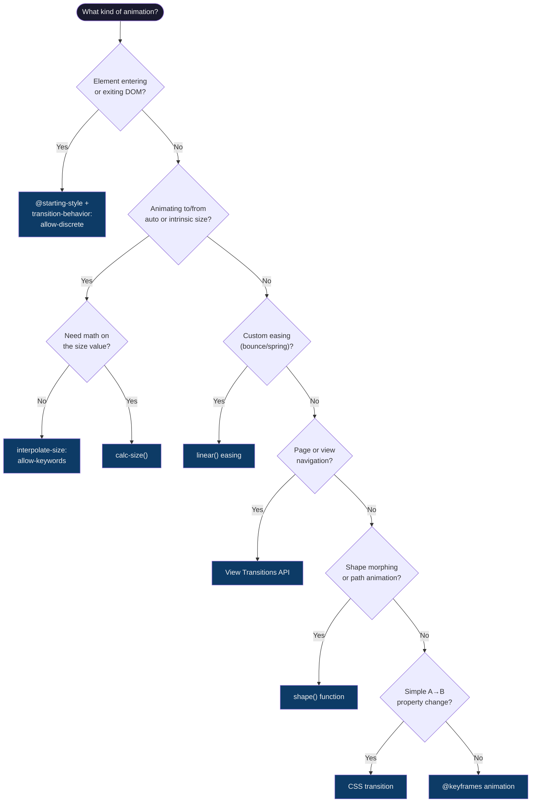
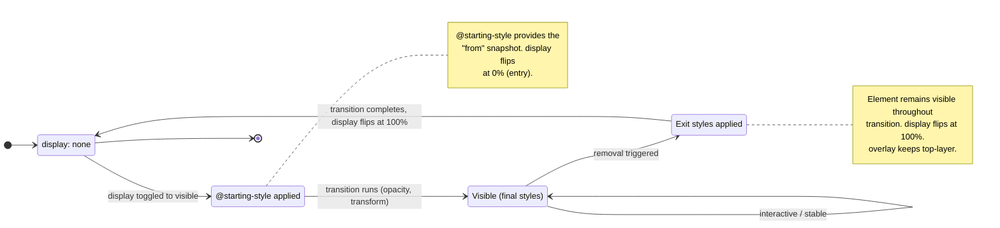

# Animation — Making Things Move

> Sources: [CSS Transitions Level 2](https://www.w3.org/TR/css-transitions-2/), [CSS Animations Level 2](https://www.w3.org/TR/css-animations-2/), [CSS View Transitions Level 2](https://www.w3.org/TR/css-view-transitions-2/), [CSS Easing Functions Level 2](https://www.w3.org/TR/css-easing-2/), [Interop 2025](https://webkit.org/blog/16458/interop-2025/)

CSS now handles entry/exit animations, intrinsic size interpolation, custom easing curves, cross-document transitions, and responsive shape morphing — all without JavaScript.

**Every animation in this file must respect `prefers-reduced-motion`.** The universal reset appears first. Per-feature approaches appear inline.

---

## Universal Reduced-Motion Reset

Apply at the top of every project. Override selectively for essential animations (e.g., progress spinners).

```css
@media (prefers-reduced-motion: reduce) {
  *, *::before, *::after {
    animation-duration: 0.01ms !important;
    animation-iteration-count: 1 !important;
    transition-duration: 0.01ms !important;
    scroll-behavior: auto !important;
  }
}
```

Use `0.01ms` not `0s` — keeps `transitionend`/`animationend` events firing so JS listeners do not break.

---

## Animation Strategy Decision Flowchart



---

## 1. `@starting-style` — Entry Animations

Before `@starting-style`, there was no CSS way to animate an element's first render. Elements appeared at their final state instantly. Developers used `requestAnimationFrame` double-wrapping or class-toggle-after-a-frame hacks.

`@starting-style` defines the "before" state for first paint. The browser applies these styles on frame one, then transitions to normal styles.

```css
/* ❌ Before: JavaScript hack for fade-in */
```
```js
element.style.display = 'block';
requestAnimationFrame(() => {
  requestAnimationFrame(() => {
    element.classList.add('visible');
  });
});
```

```css
/* ✅ After: Pure CSS entry animation */
.tooltip {
  opacity: 1;
  transform: translateY(0);
  transition: opacity 0.3s, transform 0.3s;

  @starting-style {
    opacity: 0;
    transform: translateY(-8px);
  }
}
```

Nested form (above) is preferred — keeps entry state co-located. Standalone form also works:

```css
@starting-style {
  .tooltip { opacity: 0; transform: translateY(-8px); }
}
```

`@starting-style` alone handles elements always in the DOM. For `display: none` toggling (popovers, dialogs), pair with `transition-behavior: allow-discrete`.

**Reduced motion:** Keep fade, remove transform. `@media (prefers-reduced-motion: reduce) { .tooltip { transition-duration: 0.15s; @starting-style { transform: none; } } }`

**Browser support:** Baseline.

---

## 2. `transition-behavior: allow-discrete`

`display` and `visibility` are discrete properties — no intermediate values. Before `allow-discrete`, exit animations were impossible without JS to delay `display: none`.

How it works:
- **Entry:** `display` flips to visible at **0%** of the transition. Element is visible immediately, animates in.
- **Exit:** `display` flips to hidden at **100%**. Element stays visible throughout, then disappears.

```css
.panel {
  transition: opacity 0.3s, display 0.3s allow-discrete;
}
.panel[hidden] {
  opacity: 0;
  display: none;
}
```

### The `overlay` Property

For top-layer elements (popovers, dialogs), transition `overlay` to keep them in the top layer during exit. Without it, a popover exits the top layer immediately and the exit animation is clipped.

```css
[popover] {
  transition: opacity 0.3s, display 0.3s, overlay 0.3s;
  transition-behavior: allow-discrete;
}
```

**Browser support:** Baseline.

---

## 3. The Canonical Entry/Exit Pattern

The unified pattern combining all three primitives. Use for popovers, dialogs, `[hidden]` toggling, and DOM insertion/removal.

```css
@layer animations {
  .animated-presence {
    opacity: 1;
    transform: translateY(0);
    transition:
      opacity 0.3s ease,
      transform 0.3s ease,
      display 0.3s ease allow-discrete,
      overlay 0.3s ease allow-discrete;

    @starting-style {
      opacity: 0;
      transform: translateY(10px);
    }
  }

  .animated-presence[hidden],
  .animated-presence:not(:popover-open),
  .animated-presence:not([open]) {
    opacity: 0;
    transform: translateY(10px);
  }
}
```

| Piece | Role | Without It |
|-------|------|------------|
| `@starting-style` | "from" state on entry | Appears at final state instantly |
| `allow-discrete` | `display` participates in transition | `display: none` instant, no exit animation |
| `overlay` transition | Keeps top-layer visible during exit | Popover disappears before animation completes |

### Dialog with Backdrop

```css
dialog {
  opacity: 1;
  transform: translateY(0);
  transition: opacity 0.3s, transform 0.3s,
    display 0.3s allow-discrete, overlay 0.3s allow-discrete;

  @starting-style { opacity: 0; transform: translateY(-20px); }
}
dialog:not([open]) { opacity: 0; transform: translateY(-20px); }

dialog::backdrop {
  background: hsl(0 0% 0% / 0);
  transition: background 0.3s, display 0.3s allow-discrete,
    overlay 0.3s allow-discrete;
}
dialog[open]::backdrop { background: hsl(0 0% 0% / 0.4); }
@starting-style {
  dialog[open]::backdrop { background: hsl(0 0% 0% / 0); }
}
```

**Reduced motion:** `@media (prefers-reduced-motion: reduce) { .animated-presence { transition-duration: 0.01ms; } }`

---

## Entry/Exit Lifecycle State Diagram



---

## 4. `interpolate-size: allow-keywords` — Animate to/from `auto`

CSS could never transition `height: auto`, `min-content`, `max-content`, or `fit-content`. The workaround was the `max-height: 9999px` hack — always wrong because duration maps to 9999px, not actual content height.

```css
/* ❌ max-height hack — duration is always wrong */
.accordion-body {
  max-height: 0;
  overflow: hidden;
  transition: max-height 0.5s ease;
}
.accordion.open .accordion-body {
  max-height: 9999px; /* 200px panel finishes in ~10ms */
}
```

```css
/* ✅ interpolate-size — correct duration, smooth animation */
:root {
  interpolate-size: allow-keywords;
}

.accordion-body {
  height: 0;
  overflow: hidden;
  transition: height 0.4s ease;
}
.accordion.open .accordion-body {
  height: auto; /* transitions to actual content height */
}
```

Works with all intrinsic keywords: `auto`, `min-content`, `max-content`, `fit-content`.

Setting on `:root` is safe — only affects elements that already have transitions on size properties. Does not change layout or computed values. Set once, forget it.

**Reduced motion:** Keep functional open/close, just make it instant: `transition-duration: 0.01ms`.

**Browser support:** Feature-detect:

```css
@supports (interpolate-size: allow-keywords) {
  :root { interpolate-size: allow-keywords; }
}
```

---

## 5. `calc-size()` — Math on Intrinsic Sizes

`interpolate-size` enables interpolation but not arithmetic on keywords. `calc-size()` does.

```css
.panel { height: calc-size(auto, size * 0.5); }    /* half of auto */
.tag   { width: calc-size(fit-content, size + 2rem); } /* fit-content + padding */
.cell  { width: calc-size(min-content, max(size, 100px)); } /* floor */
```

First argument: sizing keyword. Second: calculation using `size` as the resolved value.

Animatable when both states use the same keyword:

```css
.drawer {
  height: calc-size(auto, size * 0);
  overflow: hidden;
  transition: height 0.3s ease;
}
.drawer.open {
  height: calc-size(auto, size * 1);
}
```

| Scenario | Use |
|----------|-----|
| Animate `height: 0` to `height: auto` | `interpolate-size: allow-keywords` |
| Animate to 50% of `auto` height | `calc-size(auto, size * 0.5)` |
| Add padding to `fit-content` | `calc-size(fit-content, size + 1rem)` |
| Clamp `min-content` with a floor | `calc-size(min-content, max(size, 80px))` |

**Browser support:** Always feature-detect.

---

## 6. `linear()` Easing — Custom Curves

`cubic-bezier()` is confined to a unit box — no bounce, spring, or overshoot. `linear()` defines unlimited control points. Values above 1 create overshoot; below 0 create undershoot.

```css
.bounce {
  transition: transform 0.6s linear(
    0, 0.004, 0.016, 0.035, 0.063, 0.098, 0.141, 0.191,
    0.25, 0.316, 0.391, 0.472, 0.562, 0.66, 0.765, 0.878,
    1, 0.956, 0.922, 0.898, 0.883, 0.878, 0.883, 0.898,
    0.922, 0.956, 1, 0.988, 0.981, 0.978, 0.981, 0.988, 1
  );
}
```

With explicit positions: `linear(0, 0.5 25%, 1 50%, 0.8 75%, 1)`

Store as custom properties for reuse:

```css
:root {
  --ease-bounce: linear(0, 0.004, 0.016, 0.035, 0.063, 0.098, 0.141,
    0.191, 0.25, 0.316, 0.391, 0.472, 0.562, 0.66, 0.765, 0.878,
    1, 0.956, 0.922, 0.898, 0.883, 0.878, 0.883, 0.898, 0.922,
    0.956, 1, 0.988, 0.981, 0.978, 0.981, 0.988, 1);
  --ease-spring: linear(0, 0.009, 0.035, 0.078, 0.141, 0.223, 0.326,
    0.45, 0.594, 0.758, 0.938, 1.026, 1.063, 1.064, 1.042, 1.007,
    0.968, 0.938, 0.923, 0.925, 0.942, 0.966, 0.99, 1.006, 1.012,
    1.008, 0.998, 0.99, 0.988, 0.992, 0.998, 1.002, 1.003, 1.001, 1);
}
```

**Do not hand-write control points.** Use:
- [linear-easing-generator.netlify.app](https://linear-easing-generator.netlify.app/) — paste a JS easing function, get `linear()` output
- [easingwizard.com](https://easingwizard.com) — visual editor

**Reduced motion:** Spring/bounce imply spatial motion. Replace with simple ease or remove.

**Browser support:** Baseline.

---

## 7. View Transitions API

Animate state changes across the page — navigations, DOM updates, layout shifts. Browser captures a "before" snapshot, you apply the change, browser crossfades to "after."

### Same-Document (Level 1)

```js
document.startViewTransition(() => updateDOM());
```

Name specific elements for independent transitions:

```css
.hero-image { view-transition-name: hero; }
.page-title { view-transition-name: title; }

::view-transition-old(hero)  { animation: fade-out 0.3s; }
::view-transition-new(hero)  { animation: fade-in 0.3s; }
::view-transition-group(hero) { animation-duration: 0.4s; }
```

Names must be unique on the page at any given time.

### Cross-Document (Level 2)

Opt in on both source and destination pages:

```css
@view-transition { navigation: auto; }
```

Matching `view-transition-name` values across pages create shared-element transitions.

### `view-transition-class` — Bulk Styling

```css
.card { view-transition-class: card; }

::view-transition-group(*.card) {
  animation-duration: 0.3s;
  animation-timing-function: var(--ease-spring);
}
```

### `view-transition-name: match-element`

Auto-assigns unique names — essential for reorderable lists:

```css
.list-item { view-transition-name: match-element; }
```

### Nested Groups

Child transitions animate independently within a parent group:

```css
.card     { view-transition-name: card-1; }
.card img { view-transition-name: card-1-img; }

::view-transition-group(card-1-img) {
  view-transition-group: card-1; /* nest inside parent */
}
```

**Reduced motion:**
```css
@media (prefers-reduced-motion: reduce) {
  ::view-transition-group(*),
  ::view-transition-old(*),
  ::view-transition-new(*) {
    animation-duration: 0.01ms !important;
  }
}
```

**Browser support:** Level 1 Baseline. Level 2 (cross-document, `view-transition-class`, `match-element`) is Interop 2025, shipping Chrome/Safari/Firefox.

---

## 8. `shape()` Function — Responsive Shapes

`path()` uses SVG coordinates — fixed pixels, not responsive. `shape()` uses CSS units and percentages.

```css
/* ❌ path() — fixed pixel coordinates */
.clip { clip-path: path('M 0 0 L 200 0 L 200 150 Q 100 200 0 150 Z'); }

/* ✅ shape() — responsive to element size */
.clip {
  clip-path: shape(from 0% 0%, line to 100% 0%, line to 100% 70%,
    curve to 0% 70% with 50% 100%, close);
}
```

Commands: `line to`, `curve to ... with`, `smooth to`, `arc to ... of`, `hline to`, `vline to`.

Animatable when both states have the same number and type of commands:

```css
.morph {
  clip-path: shape(from 0% 0%, line to 100% 0%,
    line to 100% 100%, line to 0% 100%, close);
  transition: clip-path 0.5s var(--ease-spring);
}
.morph:hover {
  clip-path: shape(from 10% 0%, line to 90% 0%,
    line to 100% 100%, line to 0% 100%, close);
}
```

**Reduced motion:** `transition: none;` — show final state.

**Browser support:** Feature-detect with `@supports`.

---

## 9. `corner-shape` — Non-Rounded Corners

`border-radius` only makes circles/ellipses. `corner-shape` adds geometric alternatives.

```css
.card  { border-radius: 20px; corner-shape: squircle; } /* superellipse */
.tag   { border-radius: 8px;  corner-shape: bevel; }    /* 45-deg chamfer */
.badge { border-radius: 12px; corner-shape: notch; }    /* inward rectangle */
.frame { border-radius: 16px; corner-shape: scoop; }    /* concave curve */
```

`corner-shape` uses the `border-radius` value to determine treatment size.

Per-corner: `corner-shape: squircle bevel squircle bevel;` (TL, TR, BR, BL).

Animatable between shapes:

```css
.card {
  border-radius: 20px;
  corner-shape: round;
  transition: corner-shape 0.4s ease;
}
.card:hover { corner-shape: squircle; }
```

**Reduced motion:** `transition: none; corner-shape: squircle;` (apply preferred shape statically).

**Browser support:** Experimental. Always feature-detect and provide `border-radius` fallback:

```css
@supports (corner-shape: squircle) {
  .card { corner-shape: squircle; }
}
```

---

## 10. `prefers-reduced-motion` — The Accessibility Contract

Every animation must have a reduced-motion path. Motion triggers vestibular disorders, nausea, and seizures.

### Strategy: Universal Reset + Selective Override

```css
@media (prefers-reduced-motion: reduce) {
  *, *::before, *::after {
    animation-duration: 0.01ms !important;
    animation-iteration-count: 1 !important;
    transition-duration: 0.01ms !important;
    scroll-behavior: auto !important;
  }

  /* Re-enable essential animations */
  .spinner {
    animation-duration: 1s !important;
    animation-iteration-count: infinite !important;
  }
}
```

### Per-Feature Summary

| Feature | Reduced-Motion Approach |
|---------|------------------------|
| `@starting-style` | Keep opacity fade (short), remove transform |
| Entry/exit transitions | `transition-duration: 0.01ms` |
| `interpolate-size` | Instant expand/collapse (functional) |
| `linear()` bounce/spring | Replace with `ease` or remove |
| View Transitions | `animation-duration: 0.01ms` on pseudo-elements |
| `shape()` morphing | `transition: none`, show final state |
| `corner-shape` | `transition: none`, apply shape statically |

### Motion-Aware Custom Properties

```css
:root {
  --motion-duration: 0.3s;
  --motion-distance: 10px;
}
@media (prefers-reduced-motion: reduce) {
  :root {
    --motion-duration: 0.01ms;
    --motion-distance: 0;
  }
}

.element {
  transition: transform var(--motion-duration) ease;
  @starting-style { transform: translateY(var(--motion-distance)); }
}
```

> For non-Baseline features, always feature-detect with `@supports` or use progressive enhancement. Check [MDN](https://developer.mozilla.org/en-US/docs/Web/CSS) or [Baseline](https://web.dev/baseline) for current browser support.

---

## Anti-Patterns

| Anti-Pattern | Problem | Modern Replacement |
|---|---|---|
| `max-height: 9999px` | Wrong timing, always janky | `interpolate-size: allow-keywords` |
| `rAF` double-wrap for entry | Fragile timing hack | `@starting-style` |
| JS `setTimeout` to delay `display: none` | Race conditions, flickering | `transition-behavior: allow-discrete` |
| `cubic-bezier()` for bounce/spring | Cannot exceed unit box | `linear()` easing |
| Fixed-pixel SVG `path()` | Not responsive | `shape()` with CSS units |
| JS page transition libraries | Bundle size, complexity | View Transitions API |
| Ignoring `prefers-reduced-motion` | Accessibility violation | Universal reset + selective override |
| `animation: none` for reduced motion | Breaks JS event listeners | `animation-duration: 0.01ms` |
| `will-change` on everything | Wastes GPU memory | Only on elements being animated |
