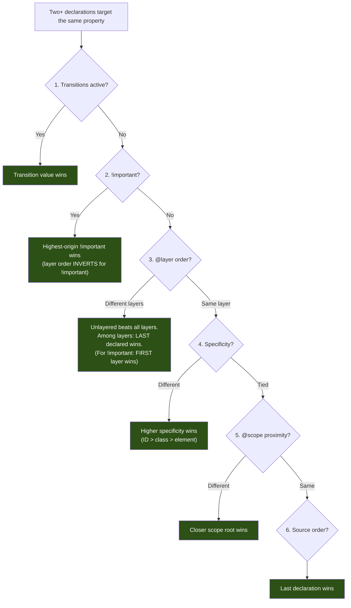

# Cascade Control — Controlling Which Styles Win

> Sources:
> - [CSS Cascading and Inheritance Level 5](https://www.w3.org/TR/css-cascade-5/) — W3C (`@layer`)
> - [CSS Cascading and Inheritance Level 6](https://www.w3.org/TR/css-cascade-6/) — W3C (`@scope`, proximity)
> - [CSS Nesting Module](https://www.w3.org/TR/css-nesting-1/) — W3C
> - [CSS Conditional Rules Level 5](https://www.w3.org/TR/css-conditional-5/) — W3C (`@supports`, `@media`)
> - [CSS Display Level 4](https://www.w3.org/TR/css-display-4/) — W3C (`reading-flow`)
> - [MDN: CSS Cascade](https://developer.mozilla.org/en-US/docs/Web/CSS/CSS_cascade) — Mozilla

## How the Cascade Resolves Styles

Every style conflict resolves through this hierarchy. The first decisive step wins:



Memorize: **Transitions > Importance > Layers > Specificity > Proximity > Source Order**.

---

## 1. Native CSS Nesting

Use native nesting to co-locate related rules. Baseline in all modern browsers. Stop using preprocessor nesting for new projects.

**Rules:**
- Nested rules implicitly start with `&` (the parent selector).
- Use explicit `&` to place the parent reference elsewhere (`a&`, `.parent &`).
- Bare element selectors (`div`, `span`) work directly without `&`.
- Nesting produces the same specificity as the equivalent flat selector.
- Nest at most 2-3 levels deep. Deeper nesting creates fragile, DOM-coupled selectors.

Nest when rules are subordinate to a parent (states, pseudo-elements, media queries). Keep flat when selectors are independent concepts.

```css
/* ❌ Preprocessor — requires build step, proprietary syntax */
.card {
  padding: 1rem;
  &__title { font-size: 1.25rem; }
  &:hover { box-shadow: 0 2px 8px rgb(0 0 0 / 0.15); }
}
```

```css
/* ✅ Native CSS nesting — no build step */
.card {
  padding: 1rem;

  .card-title { font-size: 1.25rem; }

  &:hover { box-shadow: 0 2px 8px rgb(0 0 0 / 0.15); }
}
```

### `&` Placement Patterns

```css
.button {
  background: steelblue;
  &:hover { background: darkblue; }    /* .button:hover */
  .icon { width: 1em; }                /* .button .icon */
  .wrapper & { margin: 0; }            /* .wrapper .button */
  a& { text-decoration: none; }        /* a.button */
}
```

### Nesting `@media` Inside a Rule

```css
.grid {
  display: grid;
  grid-template-columns: 1fr;

  @media (width >= 768px) { grid-template-columns: repeat(2, 1fr); }
  @media (width >= 1200px) { grid-template-columns: repeat(4, 1fr); }
}
```

---

## 2. Cascade Layers (`@layer`)

Define layer order once at the top of your CSS and specificity wars disappear. A declaration in a later layer always beats an earlier layer, regardless of selector specificity.

### The Core Insight

Without layers, overriding styles requires higher specificity (leading to `!important` arms races) or later source order (fragile). Layers decouple "which styles win" from "how specific the selector is."

### Layer Ordering

```css
/* This single line controls your entire cascade architecture */
@layer reset, base, components, utilities;
```

Priority (lowest to highest): `reset` < `base` < `components` < `utilities`. Styles in `utilities` beat `components` regardless of specificity.

### Layer Stacking

```mermaid
block-beta
  columns 1
  block:cascade["Cascade Priority (top wins)"]:1
    U["Unlayered styles (highest — beats ALL layers)"]
    L4["@layer utilities (last declared)"]
    L3["@layer components"]
    L2["@layer base"]
    L1["@layer reset (first declared = lowest)"]
  end

  style U fill:#7c2d12,color:#fff
  style L4 fill:#1e40af,color:#fff
  style L3 fill:#1e3a5f,color:#fff
  style L2 fill:#1a3350,color:#fff
  style L1 fill:#172540,color:#fff
```



**Critical:** Unlayered styles beat all layered styles. Use this intentionally for page-specific overrides. Avoid accidentally leaving styles unlayered.

### Specificity Hacks vs `@layer`

```css
/* ❌ Specificity arms race — fragile, escalates */
.nav .menu .item a { color: gray; }
.nav .menu .item a.active { color: blue; }
#main-nav .nav .menu .item a.active { color: blue !important; }
```

```css
/* ✅ @layer — simple selectors, architectural control */
@layer base, components, utilities;

@layer base { a { color: gray; } }
@layer components { .active { color: blue; } }
@layer utilities { .text-primary { color: blue; } }
```

### Three Ways to Define Layers

```css
/* 1. Block syntax */
@layer components {
  .card { padding: 1rem; }
}

/* 2. Import into a layer */
@import url("reset.css") layer(reset);
@import url("vendor.css") layer(vendor);

/* 3. Anonymous layer (cannot append to later — use sparingly) */
@layer { body { margin: 0; } }
```

### Sub-layers

Use dot notation when a layer needs internal ordering:

```css
@layer components.card, components.button, components.modal;

@layer components.card { .card { border: 1px solid #ddd; } }
@layer components.modal { .modal .card { border: none; } }
```

Sub-layers resolve within their parent. `components.modal` never competes directly with `utilities`.

### `!important` Inverts Layer Order

When `!important` is used, layer priority **inverts**. The first-declared layer's `!important` beats the last-declared layer's `!important`. This lets resets protect critical styles:

```css
@layer reset, components, utilities;

@layer reset {
  *, *::before, *::after { box-sizing: border-box !important; }
  /* Beats utilities !important because reset is first */
}
```

Avoid `!important` in layered architectures. The layer order should handle priority.

### Recommended Architecture

```css
@layer reset, base, layout, components, utilities;

@import url("modern-reset.css") layer(reset);

@layer base {
  body { font-family: system-ui, sans-serif; line-height: 1.6; }
  h1, h2, h3 { line-height: 1.2; text-wrap: balance; }
}

@layer layout {
  .page { display: grid; grid-template-rows: auto 1fr auto; min-height: 100dvh; }
}

@layer components {
  .card { padding: 1rem; border-radius: 8px; }
  .button { padding: 0.5em 1em; border: none; cursor: pointer; }
}

@layer utilities {
  .visually-hidden {
    clip: rect(0 0 0 0); clip-path: inset(50%);
    height: 1px; overflow: hidden;
    position: absolute; white-space: nowrap; width: 1px;
  }
}
```

---

## 3. `@scope` — Proximity-Based Scoping

Use `@scope` to limit where styles apply and to resolve conflicts by DOM proximity. Use it when component styles should not leak into nested sub-components.

### Basic Scoping

```css
@scope (.card) {
  h2 { font-size: 1.25rem; }
  p { color: #555; }
  .actions { display: flex; gap: 1rem; }
}
```

`@scope` does not add specificity. The advantage is containment and proximity.

### Donut Scoping — Excluding Inner Regions

Use `to` to stop matching before a nested boundary. This prevents parent styles from leaking into child components:

```css
@scope (.card) to (.card) {
  p { color: #333; }
  /* Does NOT match <p> inside a nested .card */
}
```

```html
<div class="card">
  <p>Styled by the scope.</p>
  <div class="card">
    <p>NOT styled — excluded by the "to .card" boundary.</p>
  </div>
</div>
```

Use donut scoping for recursive/nested component patterns (comments, tree views, nested cards).

### Proximity Resolution

When two `@scope` blocks target the same element with equal specificity, the closer scope root wins. This is checked after specificity but before source order:

```css
@scope (.light-theme) { p { color: #333; background: #fff; } }
@scope (.dark-theme) { p { color: #eee; background: #222; } }
```

```html
<div class="light-theme">
  <p>Light (closest root is .light-theme).</p>
  <div class="dark-theme">
    <p>Dark (closest root is .dark-theme — proximity wins).</p>
    <div class="light-theme">
      <p>Light again (inner .light-theme is closest).</p>
    </div>
  </div>
</div>
```

Proximity makes nested theming work without specificity tricks.

### Inline `<style>` Scoping

Use `@scope` without a selector inside `<style>` to scope to the parent element:

```html
<div class="widget">
  <style>
    @scope {
      p { color: navy; }
      .title { font-weight: bold; }
    }
  </style>
  <p class="title">Scoped to this widget only.</p>
</div>
```

### Theming with Donut Scopes

Combine donut scoping with custom properties to prevent theme bleed-through:

```css
.light-theme { --surface: #fff; --text: #1a1a1a; }
.dark-theme { --surface: #1a1a1a; --text: #e5e5e5; }

@scope (.light-theme) to (.dark-theme) {
  .card { background: var(--surface); color: var(--text); }
}
@scope (.dark-theme) to (.light-theme) {
  .card { background: var(--surface); color: var(--text); }
}
```

### The Full Cascade Hierarchy (with Scope)

1. **Importance** — `!important` (with inverted layer order)
2. **Layers** — later `@layer` beats earlier; unlayered beats all
3. **Specificity** — ID (1,0,0) > class (0,1,0) > element (0,0,1)
4. **Proximity** — closer `@scope` root wins
5. **Source order** — last declaration wins

---

## 4. `@supports` — Feature Queries

Use `@supports` for features not yet Baseline. Do not wrap Baseline features in `@supports` — it adds unnecessary complexity.

### Feature Detection Patterns

```css
/* Fallback */
.grid { display: flex; flex-wrap: wrap; }

/* Enhance when available */
@supports (grid-template-columns: subgrid) {
  .grid {
    display: grid;
    grid-template-columns: repeat(3, 1fr);
  }
  .grid > * { display: grid; grid-template-rows: subgrid; }
}
```

### Detecting Modern Features

```css
@supports (selector(:has(a)))       { /* :has() available */ }
@supports (container-type: inline-size) { /* container queries */ }
@supports (anchor-name: --tip)      { /* anchor positioning */ }
@supports (reading-flow: grid-rows) { /* reading-flow */ }
```

### Negation and Combination

```css
@supports not (display: grid) { .layout { display: flex; } }
@supports (display: grid) and (grid-template-columns: subgrid) { /* both */ }
@supports (overflow: clip) or (overflow: hidden) { /* either */ }
```

### Progressive Enhancement Pattern

Structure as enhancement layers — base works everywhere, enhancements add capabilities:

```css
.card { padding: 1rem; background: white; }

@supports (color: oklch(0.7 0.15 200)) {
  .card { background: oklch(0.98 0.01 200); }
}

@supports (selector(@scope (.a))) {
  @scope (.card) to (.card) { p { margin-block: 0.5em; } }
}
```

---

## 5. `@media` Range Syntax

Use modern range syntax for media queries. More readable, less error-prone, Baseline in all modern browsers.

```css
/* ❌ Legacy — verbose, off-by-one risk */
@media (min-width: 768px) and (max-width: 1199px) {
  .sidebar { width: 250px; }
}
```

```css
/* ✅ Modern — reads like math */
@media (768px <= width < 1200px) { .sidebar { width: 250px; } }
@media (width >= 1200px) { .sidebar { width: 300px; } }
```

### Common Patterns

```css
@media (width >= 768px) { /* tablet and up */ }
@media (width < 768px) { /* mobile only */ }
@media (768px <= width < 1200px) { /* tablet only */ }
@media (height >= 600px) { /* sufficient vertical space */ }
@media (aspect-ratio > 16/9) { /* ultrawide */ }
```

Combine with nesting to co-locate responsive rules:

```css
.nav {
  display: flex;
  flex-direction: column;
  @media (width >= 768px) { flex-direction: row; gap: 2rem; }
}
```

---

## 6. `reading-flow` — Tab Order Matching Visual Layout

When CSS reorders content visually (`order`, `grid-row`, `flex-direction: row-reverse`), keyboard tab order still follows DOM order. `reading-flow` fixes this accessibility gap.

```css
/* ❌ Visual order differs from tab order */
.grid { display: grid; }
.grid .featured { order: -1; /* Visually first, tabbed last */ }
```

```css
/* ✅ Tab order follows visual layout */
.grid {
  display: grid;
  reading-flow: grid-rows;
}
.flex-container {
  display: flex;
  reading-flow: flex-visual;
}
```

| Value | Behavior |
|-------|----------|
| `normal` | Tab follows DOM order (default) |
| `flex-visual` | Follows visual flex item order |
| `flex-flow` | Follows `flex-flow` direction |
| `grid-rows` | Follows visual grid rows |
| `grid-columns` | Follows visual grid columns |
| `grid-order` | Follows `order` property in grid |

Apply whenever CSS changes visual order. Feature-detect first:

```css
@supports (reading-flow: grid-rows) {
  .reordered-grid { reading-flow: grid-rows; }
}
```

---

## Putting It All Together

```css
@layer reset, base, layout, components, utilities;
@import url("reset.css") layer(reset);

@layer base {
  :root { --surface: oklch(0.99 0 0); --text: oklch(0.15 0 0); }
  body { font-family: system-ui, sans-serif; color: var(--text); }
}

@layer layout {
  .page {
    display: grid; grid-template-rows: auto 1fr auto; min-height: 100dvh;
    @media (width >= 1200px) { grid-template-columns: 250px 1fr; }
  }
}

@layer components {
  @scope (.card) to (.card) {
    :scope { padding: 1rem; background: var(--surface); }
    h2 { font-size: 1.25rem; }
    .actions { display: flex; gap: 0.5rem; margin-block-start: 1rem; }
  }
}

@layer utilities {
  .sr-only {
    clip: rect(0 0 0 0); clip-path: inset(50%);
    height: 1px; overflow: hidden; position: absolute;
    white-space: nowrap; width: 1px;
  }
}

/* Unlayered — page-specific overrides (beats ALL layers) */
.page-home .card { border: 2px solid oklch(0.6 0.15 250); }
```

### Decision Guide

| Situation | Tool |
|-----------|------|
| Control which stylesheet wins | `@layer` |
| Prevent styles leaking to child components | `@scope` with donut scoping |
| Nested themes without specificity tricks | `@scope` proximity |
| Co-locate responsive + base styles | Native nesting + `@media` |
| Fallbacks for newer features | `@supports` |
| Readable breakpoints | `@media` range syntax |
| Fix tab order after visual reordering | `reading-flow` |
| Override layered styles without `!important` | Unlayered styles |
| Protect critical resets | `!important` in first-declared layer |

### Anti-Patterns

| Do Not | Instead |
|--------|---------|
| Leave styles unlayered in a layered codebase | Place all styles in an explicit layer |
| Use `!important` to win specificity battles | Use `@layer` ordering |
| Nest selectors deeper than 3 levels | Flatten or use `@scope` |
| Wrap Baseline features in `@supports` | Use them directly |
| Use `min-width`/`max-width` media syntax | Range syntax (`width >= 768px`) |
| Reorder visually without `reading-flow` | Add `reading-flow` or fix DOM order |
| Create anonymous layers for important styles | Name all layers |
| Rely on source order for critical overrides | Use explicit `@layer` ordering |
