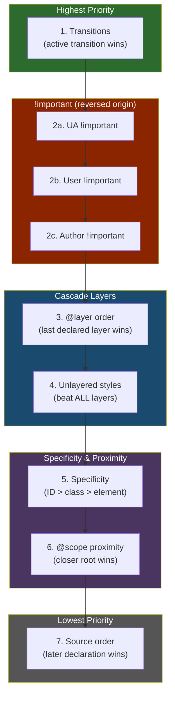
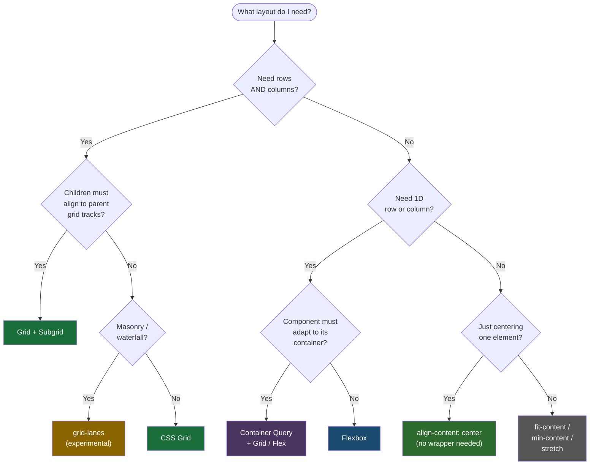

# Quick Reference Cheatsheet
> See [SKILL.md](../SKILL.md#sources) for full source list.

---

## Cascade Resolution Hierarchy



**Key rule:** Unlayered styles > Last layer > ... > First layer. Define order once:
```css
@layer reset, base, components, utilities;
/* reset = lowest priority, unlayered = highest */
```

**Layer priority shorthand:**
```
Unlayered > utilities > components > base > reset
```

**Specificity weight:** `(ID, CLASS, ELEMENT)` -- `:is()/:not()/:has()` take highest argument. `:where()` always 0.

---

## Layout Decision Flow



---

## Legacy to Modern Quick Upgrades

### 1. Color syntax
```css
/* ❌ */ background: rgba(100, 50, 200, 0.5);
/* ✅ */ background: rgb(100 50 200 / 0.5);
```

### 2. Physical to logical
```css
/* ❌ */ margin-left: 1rem;
/* ✅ */ margin-inline-start: 1rem;
```

### 3. Preprocessor nesting to native
```css
/* ❌ */ .card { .title { /* requires Sass */ } }
/* ✅ */ .card { .title { color: inherit; } } /* native CSS nesting */
```

### 4. Media query syntax
```css
/* ❌ */ @media (min-width: 768px) { }
/* ✅ */ @media (width >= 768px) { }
```

### 5. Specificity wars to layers
```css
/* ❌ */ .btn { color: red !important; }
/* ✅ */ @layer base { .btn { color: red; } }
```

### 6. JS parent selection to :has()
```css
/* ❌ */ /* JS: card.querySelector('img') && card.classList.add('has-img') */
/* ✅ */ .card:has(img) { grid-template-rows: 200px 1fr; }
```

### 7. JS scroll listener to scroll-driven animation
```css
/* ❌ */ /* JS: window.addEventListener('scroll', updateProgress) */
/* ✅ */ .progress { animation: grow linear; animation-timeline: scroll(); }
```

### 8. JS tooltip position to anchor positioning
```css
/* ❌ */ /* JS: Floating UI / Popper.js for tooltip placement */
/* ✅ */ .tooltip { position: fixed; position-anchor: --trigger; inset-area: block-start; }
```

### 9. Max-height hack to interpolate-size
```css
/* ❌ */ .panel { max-height: 9999px; transition: max-height 0.3s; }
/* ✅ */ .panel { interpolate-size: allow-keywords; transition: height 0.3s; height: auto; }
```

### 10. Sass variables to custom properties
```css
/* ❌ */ $primary: #3b82f6; /* Sass — compile-time only */
/* ✅ */ :root { --primary: oklch(0.59 0.2 260); } /* runtime, inherits, responds to context */
```

### 11. Sass color functions to color-mix / relative color
```css
/* ❌ */ darken($primary, 10%); /* Sass only */
/* ✅ */ color-mix(in oklch, var(--primary), black 20%);
/* ✅ */ oklch(from var(--primary) calc(l - 0.1) c h); /* relative color */
```

### 12. appearance: none to base-select
```css
/* ❌ */ select { appearance: none; } /* destroys all native behavior */
/* ✅ */ select { appearance: base-select; } /* styleable AND functional */
```

### 13. JS auto-resize textarea to field-sizing
```css
/* ❌ */ /* JS: textarea.style.height = textarea.scrollHeight + 'px' */
/* ✅ */ textarea { field-sizing: content; }
```

### 14. Manual stagger delays to sibling-index()
```css
/* ❌ */ li:nth-child(1) { --d: 0ms; } li:nth-child(2) { --d: 50ms; } /* ... */
/* ✅ */ li { transition-delay: calc(sibling-index() * 50ms); }
```

### 15. Hex colors to oklch
```css
/* ❌ */ color: #3b82f6;
/* ✅ */ color: oklch(0.59 0.2 260); /* perceptually uniform, P3 gamut */
```

---

## CSS Replaces JavaScript

| JS Pattern | CSS Replacement |
|---|---|
| Scroll position listeners | `animation-timeline: scroll()` |
| IntersectionObserver for reveal | `animation-timeline: view()` |
| Sticky header shadow toggle | `scroll-state(stuck: top)` |
| Floating UI / Popper.js | Anchor positioning (`position-anchor`, `inset-area`) |
| Carousel prev/next/dots | `::scroll-button()`, `::scroll-marker` |
| Auto-expanding textarea | `field-sizing: content` |
| Staggered animation delays | `sibling-index()` in `calc()` |
| `max-height: 9999px` hack | `interpolate-size: allow-keywords` |
| Parent element selection | `:has()` |
| Theme toggle logic | `light-dark()` + `color-scheme` |
| Tooltip/popover show/hide | Popover API + invoker commands |
| Color manipulation | `color-mix()`, relative color syntax |

---

## Property Quick Reference by Category

### Layout

| Property / At-Rule | Values / Syntax | Purpose |
|---|---|---|
| `display` | `grid`, `flex`, `contents`, `none` | Layout mode |
| `grid-template-columns` | `repeat(auto-fill, minmax(250px, 1fr))` | Responsive columns |
| `grid-template-rows` | `subgrid` | Inherit parent tracks |
| `grid-auto-flow` | `dense` | Fill gaps automatically |
| `container-type` | `inline-size`, `size`, `normal`, `scroll-state` | Enable container queries |
| `container-name` | `<custom-ident>` | Name the container |
| `@container` | `(inline-size >= 400px)` | Query container dimensions |
| `@container style()` | `style(--theme: dark)` | Query container custom props |
| `align-content` | `center` (on block elements) | Vertical centering without flex/grid |
| `place-items` | `center` | Shorthand for align + justify items |
| `gap` | `1rem`, `1rem 2rem` | Row and column gap |

### Cascade & Scope

| Syntax | Purpose | Key Behavior |
|---|---|---|
| `@layer reset, base, components;` | Declare layer order | First = lowest priority |
| `@layer base { ... }` | Add rules to a layer | Unlayered beats all layers |
| `@scope (.card) to (.card-footer)` | Limit style reach | Proximity wins over specificity |
| `.parent { .child { } }` | Native nesting | `&` optional before classes |
| `.parent { & .child { } }` | Explicit nesting | `&` required before element selectors |
| `.parent { @media (...) { } }` | Nested media query | Scoped to parent context |
| `@import url() layer(name)` | Import into a layer | Third-party CSS isolation |

### Color

| Function | Syntax | Notes |
|---|---|---|
| `oklch()` | `oklch(L C H)` or `oklch(L C H / A)` | L: 0-1, C: 0-0.4, H: 0-360 |
| `oklab()` | `oklab(L a b)` or `oklab(L a b / A)` | Perceptual, good for gradients |
| `color-mix()` | `color-mix(in oklch, color1, color2 %)` | Mix two colors in any space |
| `light-dark()` | `light-dark(lightVal, darkVal)` | Requires `color-scheme` set |
| Relative color | `oklch(from var(--c) calc(l - 0.1) c h)` | Derive colors from base |
| `color()` | `color(display-p3 1 0 0)` | Wide-gamut P3 colors |

### Animation & Transitions

| Property / At-Rule | Syntax | Purpose |
|---|---|---|
| `@starting-style` | `@starting-style { .el { opacity: 0; } }` | Entry animation initial state |
| `transition-behavior` | `allow-discrete` | Animate `display`, `overlay` |
| `interpolate-size` | `allow-keywords` | Animate to/from `auto` |
| `animation-timeline` | `scroll()`, `view()`, `--name` | Scroll-driven animations |
| `animation-range` | `entry 0% entry 100%` | Visible range for `view()` |
| `view-transition-name` | `<custom-ident>` | Opt element into view transition |
| `linear()` | `linear(0, 0.5 25%, 1)` | Custom easing with stops |
| `overlay` | `auto`, `none` | Keep element in top layer during exit |

### Selectors

| Selector | Specificity | Purpose |
|---|---|---|
| `:has()` | Highest in list | Parent/relational selection |
| `:is()` | Highest in list | Grouping (carries specificity) |
| `:where()` | Always 0 | Grouping (zero specificity) |
| `:not()` | Highest in list | Negation with selector list |
| `:focus-visible` | (0,1,0) | Keyboard-only focus ring |
| `:user-valid` / `:user-invalid` | (0,1,0) | Form validation after interaction |
| `:nth-child(... of S)` | (0,1,0) + S | Filter nth-child by selector |

---

## Color Function Syntax

| Function | Parameters | Example |
|---|---|---|
| `oklch(L C H)` | L: 0-1 lightness, C: 0-0.4 chroma, H: 0-360 hue | `oklch(0.7 0.15 145)` |
| `oklch(L C H / A)` | + alpha 0-1 | `oklch(0.7 0.15 145 / 0.5)` |
| `oklab(L a b)` | L: 0-1, a/b: -0.4 to 0.4 | `oklab(0.7 -0.1 0.1)` |
| `color(space R G B)` | space: `srgb`, `display-p3`, `rec2020` | `color(display-p3 1 0.5 0)` |
| `color-mix(in space, c1, c2 %)` | Any color space, two colors, optional % | `color-mix(in oklch, red, blue 30%)` |
| `light-dark(light, dark)` | Two color values | `light-dark(#fff, #1a1a1a)` |
| Relative: `oklch(from ...)` | `from <color> L C H` with `calc()` | `oklch(from var(--c) calc(l+0.1) c h)` |
| `rgb(R G B / A)` | Space-separated, no commas | `rgb(100 200 50 / 0.8)` |
| `hsl(H S L / A)` | H: deg, S/L: % | `hsl(260 80% 50% / 0.9)` |

### OKLCH Hue Reference

| Hue Range | Color | Common Use |
|---|---|---|
| 0-30 | Pink/Red | Error, danger |
| 30-70 | Orange/Yellow | Warning |
| 70-140 | Yellow/Green | Success |
| 140-200 | Green/Cyan | Confirmation |
| 200-270 | Blue | Primary, info, links |
| 270-330 | Purple/Magenta | Accent |
| 330-360 | Pink/Red | Back to error |

### Common Color Recipes

```css
/* Auto dark/light theme */
:root { color-scheme: light dark; }
body { color: light-dark(#1a1a1a, #e5e5e5); background: light-dark(#fff, #111); }

/* Palette from one base color */
--base: oklch(0.6 0.2 260);
--lighter: oklch(from var(--base) calc(l + 0.2) c h);
--darker: oklch(from var(--base) calc(l - 0.2) c h);
--muted: oklch(from var(--base) l calc(c * 0.5) h);
--transparent: oklch(from var(--base) l c h / 0.2);

/* Semi-transparent overlay */
--overlay: color-mix(in oklch, var(--base), transparent 60%);
```

---

## Unit Reference

### Viewport Units

| Unit | Measures | When to Use |
|---|---|---|
| `dvh` / `dvw` | Dynamic viewport (adjusts for mobile URL bar) | Full-screen hero sections, mobile layouts |
| `svh` / `svw` | Small viewport (URL bar visible) | Minimum safe area sizing |
| `lvh` / `lvw` | Large viewport (URL bar hidden) | Maximum available space |
| `dvb` / `dvi` | Dynamic block/inline (logical) | Writing-mode-aware viewports |
| `vmin` / `vmax` | Smaller/larger of `vw`/`vh` | Responsive typography |

### Container Units

| Unit | Measures | When to Use |
|---|---|---|
| `cqw` | 1% of container's width | Component-relative sizing |
| `cqh` | 1% of container's height | Requires `container-type: size` |
| `cqi` | 1% of container's inline size | Writing-mode-aware (preferred) |
| `cqb` | 1% of container's block size | Writing-mode-aware block |
| `cqmin` / `cqmax` | Smaller/larger of `cqi`/`cqb` | Adaptive within container |

### Other Modern Units

| Unit | Measures | When to Use |
|---|---|---|
| `lh` | Computed `line-height` of element | Vertical spacing relative to text |
| `rlh` | Computed `line-height` of root | Consistent baseline grid |
| `cap` | Cap height of font | Optical alignment with text |
| `rex` | Root element's x-height | Consistent small sizing |
| `ic` | Width of CJK ideograph | CJK typography spacing |

---

## Logical Properties Mapping

| Physical | Logical | Axis |
|---|---|---|
| `width` | `inline-size` | Inline |
| `height` | `block-size` | Block |
| `min-width` | `min-inline-size` | Inline |
| `max-height` | `max-block-size` | Block |
| `margin-top` | `margin-block-start` | Block |
| `margin-bottom` | `margin-block-end` | Block |
| `margin-left` | `margin-inline-start` | Inline |
| `margin-right` | `margin-inline-end` | Inline |
| `padding-left` | `padding-inline-start` | Inline |
| `padding-right` | `padding-inline-end` | Inline |
| `border-top` | `border-block-start` | Block |
| `border-bottom` | `border-block-end` | Block |
| `top` | `inset-block-start` | Block |
| `bottom` | `inset-block-end` | Block |
| `left` | `inset-inline-start` | Inline |
| `right` | `inset-inline-end` | Inline |
| `text-align: left` | `text-align: start` | Inline |
| `float: left` | `float: inline-start` | Inline |
| `border-radius: 8px 0 0 8px` | `border-start-start-radius: 8px; border-end-start-radius: 8px` | Both |

Shorthands: `margin-block`, `margin-inline`, `padding-block`, `padding-inline`, `inset-block`, `inset-inline`.

---

## Grid Pattern Recipes

### Responsive auto-fill columns
```css
.grid {
  display: grid;
  grid-template-columns: repeat(auto-fill, minmax(min(250px, 100%), 1fr));
  gap: 1rem;
}
```

### Holy grail layout
```css
body {
  display: grid;
  grid-template: "header header" auto
                 "sidebar main" 1fr
                 "footer footer" auto / 250px 1fr;
  min-block-size: 100dvh;
}
```

### Subgrid card alignment
```css
.card-grid { display: grid; grid-template-columns: repeat(3, 1fr); gap: 1rem; }
.card {
  display: grid;
  grid-template-rows: subgrid;
  grid-row: span 3; /* title, content, footer */
}
```

### Full-bleed inside constrained parent
```css
.full-bleed {
  inline-size: 100vw;
  margin-inline: calc(50% - 50vw);
}
```

---

## @supports Feature Detection

| Feature | `@supports` Test |
|---|---|
| Container queries | `(container-type: inline-size)` |
| `:has()` | `selector(:has(*))` |
| Nesting | `selector(&)` |
| `@layer` | `at-rule(@layer)` |
| Anchor positioning | `(anchor-name: --a)` |
| `interpolate-size` | `(interpolate-size: allow-keywords)` |
| `field-sizing` | `(field-sizing: content)` |
| Customizable select | `(appearance: base-select)` |
| Scroll-state queries | `(container-type: scroll-state)` |
| View transitions | `(view-transition-name: a)` |
| `oklch()` | `(color: oklch(0 0 0))` |
| `light-dark()` | `(color: light-dark(#000, #fff))` |
| Subgrid | `(grid-template-rows: subgrid)` |
| `@starting-style` | _no direct test; wrap in `@supports` block_ |

---

## Common Patterns

### Entry/exit animation (display: none toggling)
```css
.dialog {
  opacity: 1;
  scale: 1;
  transition: opacity 0.3s, scale 0.3s, display 0.3s allow-discrete, overlay 0.3s allow-discrete;

  @starting-style {
    opacity: 0;
    scale: 0.95;
  }
}
.dialog:not([open]) {
  opacity: 0;
  scale: 0.95;
  display: none;
}
```

### Scroll progress bar
```css
.progress-bar {
  position: fixed;
  inset-block-start: 0;
  inset-inline: 0;
  block-size: 3px;
  background: oklch(0.6 0.2 260);
  transform-origin: inline-start;
  animation: progress-grow linear;
  animation-timeline: scroll(root);
}
@keyframes progress-grow { from { scale: 0 1; } to { scale: 1 1; } }
```

### Anchor-positioned tooltip
```css
.trigger { anchor-name: --trigger; }
.tooltip {
  position: fixed;
  position-anchor: --trigger;
  inset-area: block-start;
  margin-block-end: 0.5rem;
  position-try-fallbacks: flip-block, flip-inline;
}
```

### Dark mode with light-dark()
```css
:root {
  color-scheme: light dark;
  --surface: light-dark(oklch(0.98 0 0), oklch(0.15 0 0));
  --text: light-dark(oklch(0.2 0 0), oklch(0.9 0 0));
  --border: light-dark(oklch(0.85 0 0), oklch(0.3 0 0));
}
```

### Container query responsive card
```css
.card-wrapper { container-type: inline-size; container-name: card; }

@container card (inline-size < 300px) {
  .card { flex-direction: column; }
  .card img { aspect-ratio: 16/9; inline-size: 100%; }
}
@container card (inline-size >= 300px) {
  .card { flex-direction: row; }
  .card img { inline-size: 150px; }
}
```

### Typed custom property with @property
```css
@property --hue {
  syntax: "<number>";
  initial-value: 260;
  inherits: true;
}
/* Now --hue can be animated/transitioned */
.el { --hue: 260; transition: --hue 0.3s; }
.el:hover { --hue: 145; }
.el { color: oklch(0.6 0.2 var(--hue)); }
```

---

## Progressive Enhancement Template

```css
/* Base: works everywhere */
.layout {
  display: flex;
  flex-wrap: wrap;
  gap: 1rem;
}

/* Enhancement: container queries */
@supports (container-type: inline-size) {
  .wrapper { container-type: inline-size; }
  @container (inline-size >= 600px) {
    .layout { display: grid; grid-template-columns: 1fr 1fr; }
  }
}

/* Enhancement: :has() */
@supports selector(:has(*)) {
  .card:has(img) { grid-template-rows: 200px 1fr; }
}

/* Enhancement: anchor positioning */
@supports (anchor-name: --a) {
  .trigger { anchor-name: --trigger; }
  .tooltip {
    position: fixed;
    position-anchor: --trigger;
    inset-area: block-start;
  }
}

/* Enhancement: Chrome-only features */
@supports (interpolate-size: allow-keywords) {
  :root { interpolate-size: allow-keywords; }
}

@supports (appearance: base-select) {
  select { appearance: base-select; }
}

@supports (field-sizing: content) {
  textarea { field-sizing: content; }
}
```

---

## Anti-Patterns Recap

| # | Anti-Pattern | Fix |
|---|---|---|
| 1 | `!important` for overrides | `@layer` cascade control |
| 2 | Deep nesting `.a .b .c .d` | Flat selectors, `@scope` |
| 3 | IDs for styling `#header` | Classes `.header` |
| 4 | `@media` for component sizing | Container queries |
| 5 | JS scroll listeners | Scroll-driven animations |
| 6 | JS tooltip positioning | Anchor positioning |
| 7 | `max-height: 9999px` | `interpolate-size: allow-keywords` |
| 8 | `margin-left` / `padding-right` | Logical properties (`margin-inline-start`) |
| 9 | `rgba()` with commas | `rgb(r g b / a)` space-separated |
| 10 | `text-wrap: balance` on paragraphs | Only headings / short text (perf) |
