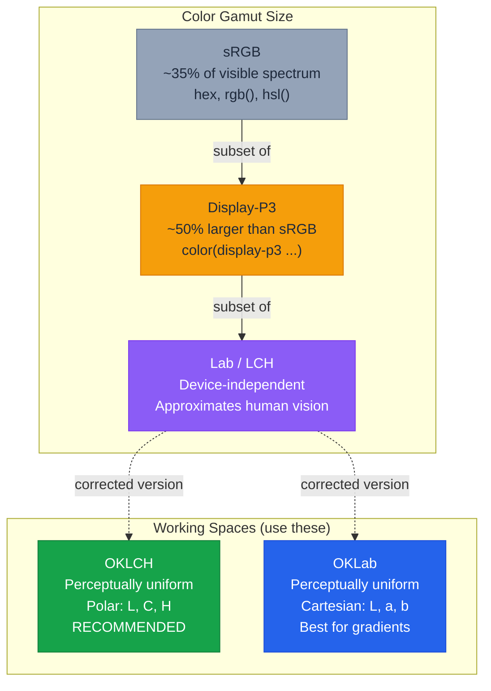

# Color — Building Perceptually Uniform Color Systems

> Sources:
> - [CSS Color Level 4](https://www.w3.org/TR/css-color-4/) — W3C Specification
> - [CSS Color Level 5](https://www.w3.org/TR/css-color-5/) — `color-mix()`, relative color syntax
> - [OKLCH in CSS: why we moved from RGB and HSL](https://evilmartians.com/chronicles/oklch-in-css-why-quit-rgb-hsl) — Evil Martians
> - [MDN: CSS Color](https://developer.mozilla.org/en-US/docs/Web/CSS/CSS_colors) — Mozilla

---

## Why Modern Color Spaces Matter

sRGB represents roughly 35% of the colors the human eye can see. Every hex value, `rgb()`, and `hsl()` color is confined to this gamut. Modern displays (P3 on Apple devices, Rec. 2020 on HDR) can render far more — Display-P3 covers ~50% more colors than sRGB.

The bigger problem is perceptual uniformity. HSL claims to separate lightness from hue, but it lies: `hsl(60, 100%, 50%)` (yellow) appears far brighter than `hsl(240, 100%, 50%)` (blue) despite identical `L` values. This makes programmatic palette generation unreliable. OKLCH fixes this — equal lightness values produce equal perceived brightness across all hues.



**Key takeaway:** Use OKLCH as your default color space. Fall back to sRGB only for legacy compatibility. Use `color-mix()` in oklch for blending. Use OKLab for gradient interpolation.

---

## Modern Syntax: Space-Separated Values

All modern color functions use space-separated syntax with `/` for alpha. The comma-separated form and the `a` suffix (`rgba`, `hsla`) are legacy.

```css
/* ❌ Legacy syntax — do not use in new code */
.legacy {
  color: rgba(31, 41, 59, 0.26);
  background: hsla(220, 14%, 96%, 0.5);
}

/* ✅ Modern syntax — space-separated, slash for alpha */
.modern {
  color: rgb(31 41 59 / 0.26);
  background: hsl(220 14% 96% / 0.5);
  border-color: oklch(0.5 0.15 240 / 0.8);
}
```

Consistent across `rgb()`, `hsl()`, `oklch()`, `oklab()`, `lab()`, `lch()`, and `color()`. Always use it.

---

## OKLCH — The Recommended Color Space

Use OKLCH as the default for all new projects, design systems, and palette generation.

### Parameters

| Parameter | Range | Description |
|-----------|-------|-------------|
| **L** (Lightness) | `0` to `1` | `0` = black, `1` = white. Perceptually linear. |
| **C** (Chroma) | `0` to `~0.4` | Color intensity. `0` = gray. Most usable values `0.01`-`0.3`. |
| **H** (Hue) | `0` to `360` | `0`=pink, `30`=red, `70`=orange, `90`=yellow, `145`=green, `240`=blue, `300`=purple. |

### When to Use

- **Design systems** — Palette scales where each step has equal visual weight
- **Programmatic palette generation** — Sweep hue at constant L and C for consistent vibrancy
- **Accessible color pairs** — Predictable contrast ratios because L is perceptually linear
- **Any new project** — There is no reason to start with HSL anymore

### OKLCH in Practice

```css
:root {
  /* Constant lightness + chroma, varying hue = equally vibrant colors */
  --color-blue:   oklch(0.6 0.2 240);
  --color-green:  oklch(0.6 0.2 145);
  --color-red:    oklch(0.6 0.2 30);
  --color-purple: oklch(0.6 0.2 300);

  /* Lightness scale — same hue/chroma, varying lightness */
  --blue-100: oklch(0.93 0.04 240);
  --blue-300: oklch(0.75 0.13 240);
  --blue-500: oklch(0.55 0.22 240);
  --blue-700: oklch(0.35 0.17 240);
  --blue-900: oklch(0.20 0.08 240);
}
```

### Why Not HSL

```css
/* ❌ HSL: Same L=50%, wildly different perceived brightness */
.hsl-problem {
  --yellow: hsl(60, 100%, 50%);   /* Appears very bright */
  --blue:   hsl(240, 100%, 50%);  /* Appears very dark */
}

/* ✅ OKLCH: Same L=0.7, same perceived brightness */
.oklch-solution {
  --yellow: oklch(0.7 0.15 90);   /* Looks equally bright */
  --blue:   oklch(0.7 0.15 240);  /* Looks equally bright */
}
```

---

## OKLab — Best for Gradient Interpolation

OKLab uses Cartesian coordinates (`L`, `a`, `b`) instead of polar (`L`, `C`, `H`). Use OKLab when interpolating between colors — it avoids the "muddy middle" and hue banding that sRGB produces, and avoids the hue-angle ambiguity of polar spaces.

```css
/* ❌ sRGB interpolation — muddy gray in the middle */
.gradient-bad {
  background: linear-gradient(in srgb, oklch(0.7 0.25 145), oklch(0.7 0.25 30));
}

/* ✅ OKLab interpolation — vibrant, no dead zone */
.gradient-good {
  background: linear-gradient(in oklab, oklch(0.7 0.25 145), oklch(0.7 0.25 30));
}

/* Also good: OKLCH with explicit hue direction */
.gradient-oklch {
  background: linear-gradient(in oklch shorter hue, oklch(0.7 0.25 145), oklch(0.7 0.25 30));
}
```

Use `in oklab` on gradients by default. Use `in oklch shorter hue` when you need to control hue direction (e.g., rainbow effects with `longer hue`).

---

## Display-P3 — Wide-Gamut Colors

Display-P3 covers vivid reds, greens, and oranges that sRGB cannot represent. Always declare an sRGB fallback first — browsers that do not support `color()` ignore it.

```css
.vivid-button {
  /* sRGB fallback */
  background-color: oklch(0.65 0.25 145);
  /* P3 override — only applied on wide-gamut displays */
  background-color: color(display-p3 0.2 0.8 0.3);
}
```

### Detecting P3 Support

```css
@media (color-gamut: p3) {
  :root {
    --brand-green: color(display-p3 0.2 0.85 0.3);
    --brand-red:   color(display-p3 0.95 0.2 0.15);
  }
}

@supports (color: color(display-p3 1 1 1)) {
  .accent { color: color(display-p3 0.9 0.3 0.2); }
}
```

### OKLCH Often Replaces P3

OKLCH with high chroma values exceeds sRGB — browsers automatically map to the widest available gamut. **OKLCH with high chroma is often simpler than explicit P3 declarations.**

```css
/* Equivalent on a P3 display: */
.option-a { color: color(display-p3 0.2 0.8 0.3); }
.option-b { color: oklch(0.72 0.3 145); }  /* Auto-mapped to P3 */
```

Prefer OKLCH unless you need exact Display-P3 coordinates from a design tool.

---

## `color-mix()` — Blending Colors

`color-mix()` blends two colors in a specified color space. The interpolation space matters enormously.

### CRITICAL: Interpolation Space Matters

```css
/* ❌ Mixing in sRGB — produces muddy, desaturated result */
.muddy { background: color-mix(in srgb, blue, yellow); }

/* ✅ Mixing in OKLCH — preserves vibrancy */
.vibrant { background: color-mix(in oklch, blue, yellow); }
```

Always use `in oklch` unless you have a specific reason for another space.

### Common Patterns

```css
:root {
  --brand: oklch(0.55 0.22 240);

  /* Tinting — mix with white */
  --brand-light:   color-mix(in oklch, var(--brand) 30%, white);
  --brand-lighter: color-mix(in oklch, var(--brand) 15%, white);

  /* Shading — mix with black */
  --brand-dark:   color-mix(in oklch, var(--brand) 70%, black);
  --brand-darker: color-mix(in oklch, var(--brand) 50%, black);

  /* Semi-transparent — mix with transparent */
  --brand-hover: color-mix(in oklch, var(--brand) 80%, transparent);
  --brand-ghost: color-mix(in oklch, var(--brand) 10%, transparent);

  /* Muted — mix with same-lightness gray */
  --brand-muted: color-mix(in oklch, var(--brand) 60%, oklch(0.55 0 0));

  /* Blend two theme colors */
  --secondary: oklch(0.6 0.2 145);
  --accent: color-mix(in oklch, var(--brand), var(--secondary));
}
```

---

## Relative Color Syntax — Deriving Colors from Tokens

Relative color syntax creates new colors by transforming an existing color's channels. This replaces Sass `darken()`, `lighten()`, `adjust-hue()`, and similar functions.

### Syntax

```css
oklch(from var(--base) calc(l - 0.1) c h)
```

Channel names (`l`, `c`, `h` for OKLCH) become variables usable in `calc()`.

### Transformations

```css
:root {
  --base: oklch(0.6 0.2 240);

  /* Darken / Lighten */
  --darker:  oklch(from var(--base) calc(l - 0.15) c h);
  --lighter: oklch(from var(--base) calc(l + 0.15) c h);

  /* Desaturate / Saturate */
  --muted: oklch(from var(--base) l calc(c - 0.1) h);
  --vivid: oklch(from var(--base) l calc(c + 0.1) h);
  --gray:  oklch(from var(--base) l 0 h);

  /* Complement (opposite hue) */
  --complement: oklch(from var(--base) l c calc(h + 180));

  /* Analogous (adjacent hues) */
  --analog-left:  oklch(from var(--base) l c calc(h - 30));
  --analog-right: oklch(from var(--base) l c calc(h + 30));

  /* Add alpha */
  --semi:  oklch(from var(--base) l c h / 0.5);
  --ghost: oklch(from var(--base) l c h / 0.1);
}
```

### Cross-Space Conversion

Input any format, transform in OKLCH. The browser converts automatically:

```css
:root {
  --legacy-brand: #1e40af;
  --brand-dark: oklch(from var(--legacy-brand) calc(l - 0.1) c h);
}
```

### Complete Token System

Derive an entire palette from a single base value:

```css
:root {
  --brand: oklch(0.55 0.22 240);

  /* Auto-generated scale */
  --brand-50:  oklch(from var(--brand) 0.97 calc(c * 0.1) h);
  --brand-100: oklch(from var(--brand) 0.93 calc(c * 0.2) h);
  --brand-200: oklch(from var(--brand) 0.85 calc(c * 0.4) h);
  --brand-300: oklch(from var(--brand) 0.75 calc(c * 0.6) h);
  --brand-400: oklch(from var(--brand) 0.65 calc(c * 0.8) h);
  --brand-500: oklch(from var(--brand) l c h);
  --brand-600: oklch(from var(--brand) calc(l - 0.08) c h);
  --brand-700: oklch(from var(--brand) calc(l - 0.16) c h);
  --brand-800: oklch(from var(--brand) calc(l - 0.24) calc(c * 0.8) h);
  --brand-900: oklch(from var(--brand) calc(l - 0.32) calc(c * 0.6) h);

  /* Semantic tokens from the same base */
  --brand-hover:    oklch(from var(--brand) calc(l - 0.05) c h);
  --brand-active:   oklch(from var(--brand) calc(l - 0.1) c h);
  --brand-disabled: oklch(from var(--brand) l calc(c * 0.3) h / 0.5);
  --brand-ring:     oklch(from var(--brand) l c h / 0.3);
  --brand-surface:  oklch(from var(--brand) 0.97 calc(c * 0.1) h);
}
```

---

## `light-dark()` and `color-scheme` — Theming

`light-dark()` returns one of two colors depending on the active color scheme. It requires `color-scheme` to be set.

### Setup (REQUIRED)

```css
:root {
  color-scheme: light dark;  /* Without this, light-dark() always returns the light value */
}
```

### Basic Usage

```css
:root {
  color-scheme: light dark;

  --text:    light-dark(oklch(0.2 0 0), oklch(0.9 0 0));
  --surface: light-dark(oklch(0.99 0 0), oklch(0.15 0 0));
  --border:  light-dark(oklch(0.85 0 0), oklch(0.3 0 0));
  --brand:   light-dark(oklch(0.5 0.2 240), oklch(0.7 0.2 240));
}
```

### `color-scheme` vs `prefers-color-scheme`

| Feature | `color-scheme` | `prefers-color-scheme` |
|---------|---------------|----------------------|
| **What** | CSS property on elements | Media query |
| **Scope** | Per-element (inherited) | Whole page (OS-level) |
| **Controls** | UA defaults + `light-dark()` | Conditional `@media` blocks |

`light-dark()` reads the **computed** `color-scheme`, not the media query. If the OS is in dark mode but `color-scheme: light` is forced on an element, `light-dark()` returns the light value inside that element.

### Per-Component Theme Overrides

`color-scheme` is inherited but can be overridden per element — enabling "island" theming:

```css
/* Force sidebar to always be dark, regardless of OS setting */
.sidebar {
  color-scheme: dark;
  background: var(--surface);  /* Resolves to dark variant */
  color: var(--text);          /* Resolves to dark variant */
}

/* Force modal to always be light */
.modal {
  color-scheme: light;
  background: var(--surface);  /* Resolves to light variant */
}
```

### Complete Theming Pattern

```css
:root {
  color-scheme: light dark;

  --surface-0: light-dark(oklch(1 0 0), oklch(0.13 0 0));
  --surface-1: light-dark(oklch(0.97 0 0), oklch(0.18 0 0));
  --surface-2: light-dark(oklch(0.94 0 0), oklch(0.23 0 0));

  --text-primary:   light-dark(oklch(0.15 0 0), oklch(0.93 0 0));
  --text-secondary: light-dark(oklch(0.4 0 0), oklch(0.7 0 0));
  --text-muted:     light-dark(oklch(0.6 0 0), oklch(0.5 0 0));

  --brand:        light-dark(oklch(0.5 0.2 240), oklch(0.7 0.18 240));
  --border:       light-dark(oklch(0.87 0 0), oklch(0.3 0 0));
  --shadow:       light-dark(oklch(0 0 0 / 0.1), oklch(0 0 0 / 0.4));
}

/* Scheme-specific assets still need the media query */
@media (prefers-color-scheme: dark) {
  .logo { content: url('/logo-dark.svg'); }
}
```

---

## Putting It All Together

Combines OKLCH, relative color syntax, `color-mix()`, and `light-dark()`:

```css
:root {
  color-scheme: light dark;

  /* Primitive hues — single source of truth */
  --hue-primary: 240;
  --hue-success: 145;
  --hue-danger: 25;

  /* Base colors */
  --primary: oklch(0.55 0.22 var(--hue-primary));
  --success: oklch(0.6 0.2 var(--hue-success));
  --danger:  oklch(0.6 0.22 var(--hue-danger));

  /* Semantic tokens */
  --bg:   light-dark(oklch(0.99 0 0), oklch(0.13 0 0));
  --text: light-dark(oklch(0.15 0 0), oklch(0.93 0 0));

  /* Interactive states via relative color */
  --primary-hover:  oklch(from var(--primary) calc(l - 0.05) c h);
  --primary-active: oklch(from var(--primary) calc(l - 0.1) c h);
  --primary-ring:   oklch(from var(--primary) l c h / 0.3);

  /* Surface tints via color-mix() */
  --primary-surface: color-mix(in oklch, var(--primary) 8%, var(--bg));
  --danger-surface:  color-mix(in oklch, var(--danger) 8%, var(--bg));
}

.btn-primary {
  background: var(--primary);
  color: oklch(from var(--primary) 0.98 0 h);
  &:hover { background: var(--primary-hover); }
  &:active { background: var(--primary-active); }
  &:focus-visible { outline: 2px solid var(--primary-ring); }
}

.alert-danger {
  background: var(--danger-surface);
  border-left: 3px solid var(--danger);
  color: oklch(from var(--danger) calc(l - 0.15) c h);
}
```

---

## Anti-Patterns

### Hardcoded Palettes

```css
/* ❌ Manually defining every shade — unmaintainable */
:root {
  --blue-100: #dbeafe;
  --blue-300: #93c5fd;
  --blue-500: #3b82f6;
  --blue-700: #1d4ed8;
  --blue-900: #1e3a8a;
}

/* ✅ Derive from a single base */
:root {
  --blue: oklch(0.6 0.22 240);
  --blue-100: oklch(from var(--blue) 0.93 calc(c * 0.2) h);
  --blue-500: oklch(from var(--blue) l c h);
  --blue-900: oklch(from var(--blue) 0.2 calc(c * 0.6) h);
}
```

### Legacy `rgba()` / `hsla()` Syntax

```css
/* ❌ Comma-separated, function name with 'a' suffix */
.legacy { background: rgba(59, 130, 246, 0.5); }

/* ✅ Space-separated, slash for alpha */
.modern { background: oklch(0.6 0.22 240 / 0.5); }
```

### Missing `color-scheme` Declaration

```css
/* ❌ light-dark() always returns the first (light) value */
:root { --bg: light-dark(white, #111); }

/* ✅ Must declare color-scheme first */
:root {
  color-scheme: light dark;
  --bg: light-dark(white, oklch(0.13 0 0));
}
```

### Mixing in sRGB

```css
/* ❌ sRGB interpolation produces muddy, desaturated mixes */
.bad { color: color-mix(in srgb, red, blue); }

/* ✅ OKLCH preserves chroma */
.good { color: color-mix(in oklch, red, blue); }
```

### Using HSL for Programmatic Palettes

```css
/* ❌ HSL lightness is not perceptually uniform */
.palette {
  --step-1: hsl(220, 80%, 90%);
  --step-2: hsl(220, 80%, 70%);
  --step-3: hsl(220, 80%, 50%);  /* perceived jump is uneven */
}

/* ✅ OKLCH lightness is perceptually uniform */
.palette {
  --step-1: oklch(0.9 0.08 240);
  --step-2: oklch(0.7 0.16 240);
  --step-3: oklch(0.5 0.22 240);  /* equal perceptual steps */
}
```

> For non-Baseline features, always feature-detect with `@supports` or use progressive enhancement. Check [MDN](https://developer.mozilla.org/en-US/docs/Web/CSS) or [Baseline](https://web.dev/baseline) for current browser support.
