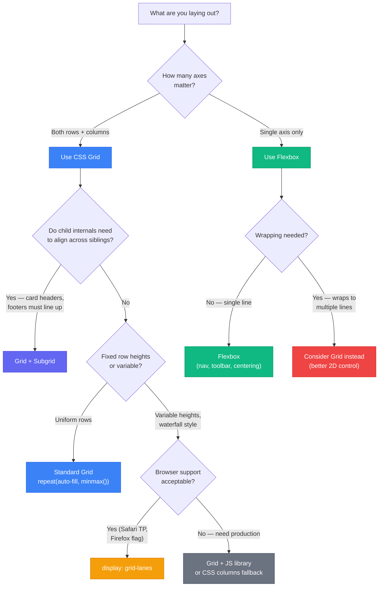
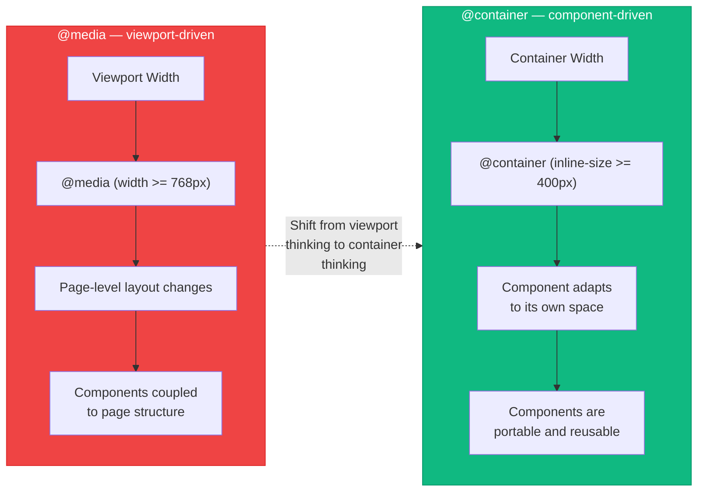

# Layout — Choosing the Right Layout System

> Sources:
> - [CSS Grid Layout Level 2 (Subgrid)](https://www.w3.org/TR/css-grid-2/) — W3C
> - [CSS Grid Layout Level 3 (Grid Lanes)](https://www.w3.org/TR/css-grid-3/) — W3C Editor's Draft
> - [CSS Containment Level 3 (Container Queries)](https://www.w3.org/TR/css-contain-3/) — W3C
> - [CSS Box Sizing Level 4 (Intrinsic Sizing)](https://www.w3.org/TR/css-sizing-4/) — W3C
> - [MDN: CSS Grid](https://developer.mozilla.org/en-US/docs/Web/CSS/CSS_grid_layout) — Mozilla
> - [MDN: Container Queries](https://developer.mozilla.org/en-US/docs/Web/CSS/Guides/Containment/Container_queries) — Mozilla

Modern CSS provides four layout primitives: **Grid** for 2D structure, **Flexbox** for 1D alignment, **Container Queries** for component-level responsiveness, and **intrinsic sizing** for content-driven dimensions. Every layout decision starts by identifying which axis matters, whether the component owns its sizing or its container does, and whether children need cross-alignment.

---

## Layout Decision Flowchart



---

## 1. CSS Grid

Use Grid when layout involves **both rows and columns** — page structure, card grids, dashboard panels, form layouts. Grid is the default choice for any 2D arrangement.

**When to use:** Page-level structure, card grids, spanning items across rows/columns, responsive grids that reflow without media queries.
**When NOT to use:** Single-axis alignment (use Flexbox), content that flows like text (use normal flow).

### Responsive Grid with `auto-fill` / `auto-fit`

```css
.card-grid {
  display: grid;
  grid-template-columns: repeat(auto-fill, minmax(280px, 1fr));
  gap: 1.5rem;
}
```

`auto-fill` keeps empty tracks (items stay at minmax size). `auto-fit` collapses empty tracks (items stretch to fill). Use `auto-fill` for consistent widths; use `auto-fit` when fewer items should expand.

### Named Grid Areas

```css
.page {
  display: grid;
  grid-template-areas:
    "header  header"
    "sidebar main"
    "footer  footer";
  grid-template-columns: 260px 1fr;
  grid-template-rows: auto 1fr auto;
  min-height: 100dvh;
}
.page-header  { grid-area: header; }
.page-sidebar { grid-area: sidebar; }
.page-main    { grid-area: main; }
.page-footer  { grid-area: footer; }

@media (width < 768px) {
  .page {
    grid-template-areas: "header" "main" "sidebar" "footer";
    grid-template-columns: 1fr;
  }
}
```

### Named Lines

Semantic anchors for item placement — no counting track numbers.

```css
.layout {
  display: grid;
  grid-template-columns:
    [full-start] 1fr
    [content-start] minmax(0, 960px)
    [content-end] 1fr
    [full-end];
}
.layout > *           { grid-column: content; }
.layout > .full-bleed { grid-column: full; }
```

### Grid Alignment

```css
.grid-container {
  place-items: center;            /* align all items: block + inline */
  place-content: space-between;   /* distribute tracks within container */
}
.grid-item {
  place-self: center end;         /* override for a single item */
}
```

---

## 2. Subgrid

Use Subgrid when **child elements inside grid items must align across sibling items**. The canonical example: a row of cards where every heading, body, and footer lines up, regardless of content length.

**Browser support:** Baseline (Sep 2023). 97% global coverage. Production-ready.

```css
/* ❌ Without subgrid: each card's rows are independent */
.card {
  display: grid;
  grid-template-rows: auto 1fr auto; /* isolated — won't align across cards */
}
```

```css
/* ✅ With subgrid: card rows inherit parent grid tracks */
.card-grid {
  display: grid;
  grid-template-columns: repeat(auto-fill, minmax(280px, 1fr));
  grid-auto-rows: auto;
  gap: 1rem 1.5rem;
}
.card {
  display: grid;
  grid-row: span 3;
  grid-template-rows: subgrid;
}
.card-heading { grid-row: 1; }
.card-body    { grid-row: 2; }
.card-footer  { grid-row: 3; }
```

Subgrid can apply to one axis independently. Use `grid-template-rows: subgrid` with custom columns, or `grid-template-columns: subgrid` with custom rows.

### Fallback for Legacy Browsers

```css
.card {
  display: grid;
  grid-template-rows: auto 1fr auto;
}
@supports (grid-template-rows: subgrid) {
  .card {
    grid-row: span 3;
    grid-template-rows: subgrid;
  }
}
```

---

## 3. Grid Lanes (Masonry)

Use Grid Lanes when content has **variable heights and must pack tightly** — image galleries, Pinterest-style feeds, mixed-content cards.

**Status: Experimental.** Behind flags in Safari TP, Firefox, and Chrome. Not production-ready.

Grid Lanes defines strict lanes (columns) via `grid-template-columns` but lets items flow freely in the stacking axis. Items pack into whichever lane gets them closest to the top.

```css
.gallery {
  display: grid-lanes;
  grid-template-columns: repeat(auto-fill, minmax(250px, 1fr));
  gap: 1rem;
}
```

The `flow-tolerance` property relaxes strict shortest-lane placement — items can go into a slightly taller lane to stay closer to source order:

```css
.gallery {
  display: grid-lanes;
  grid-template-columns: repeat(3, 1fr);
  flow-tolerance: 50px;
  gap: 1rem;
}
```

### Progressive Enhancement

```css
/* ❌ No fallback — broken in most browsers */
.gallery { display: grid-lanes; }
```

```css
/* ✅ Progressive enhancement */
.gallery {
  display: grid;
  grid-template-columns: repeat(auto-fill, minmax(250px, 1fr));
  gap: 1rem;
}
@supports (display: grid-lanes) {
  .gallery { display: grid-lanes; }
}
```

CSS columns as an alternative fallback (closer visual approximation):

```css
.gallery {
  columns: 250px;
  column-gap: 1rem;
}
.gallery > * { break-inside: avoid; margin-bottom: 1rem; }

@supports (display: grid-lanes) {
  .gallery {
    columns: unset;
    display: grid-lanes;
    grid-template-columns: repeat(auto-fill, minmax(250px, 1fr));
    gap: 1rem;
  }
  .gallery > * { break-inside: unset; margin-bottom: unset; }
}
```

| Feature | Standard Grid | Grid Lanes | Flexbox Wrap |
|---------|--------------|------------|--------------|
| Axis control | 2D (rows + columns) | Lanes + free stacking | 1D + wrap |
| Variable heights | Gaps between items | Tight packing | Uneven rows |
| Named areas/lines | Yes | Yes (lane axis only) | No |
| Browser support | Baseline | Experimental | Baseline |

---

## 4. Flexbox

Use Flexbox for **single-axis layout** — distributing space, centering, navigation bars, toolbars, inline controls.

**When to use:** Centering, nav bars, toolbars, button groups, distributing space in a row/column.
**When NOT to use:** 2D layouts (use Grid), wrapping card grids (use Grid with `auto-fill`), layouts where items in different rows must align vertically.

### Centering

```css
.center {
  display: flex;
  place-content: center;
  place-items: center;
}
```

### Space Distribution

```css
.toolbar {
  display: flex;
  gap: 0.5rem;
}
.toolbar .push-right { margin-inline-start: auto; }

.nav  { display: flex; justify-content: space-between; }
.tabs { display: flex; justify-content: space-evenly; }
```

### Flex Sizing

```css
/* Equal columns */
.equal { display: flex; & > * { flex: 1; } }

/* Fixed sidebar + fluid main */
.layout {
  display: flex;
  .sidebar { flex: 0 0 260px; }
  .main    { flex: 1; }
}
```

### Anti-Pattern: Flexbox for Card Grids

```css
/* ❌ Last row items stretch unevenly */
.card-grid { display: flex; flex-wrap: wrap; gap: 1rem; }
.card { flex: 1 1 300px; }
```

```css
/* ✅ Grid guarantees consistent columns */
.card-grid {
  display: grid;
  grid-template-columns: repeat(auto-fill, minmax(300px, 1fr));
  gap: 1rem;
}
```

---

## 5. Container Queries

Container queries shift responsive design from **viewport-based to component-based**. The core principle: **components should respond to their container, not the viewport.** A card in a wide main column should look different from the same card in a narrow sidebar — and that logic belongs to the card, not a media query that knows the page layout.

### Container vs Media Query Mental Model



Use `@media` for page-level layout (sidebar collapses, nav changes). Use `@container` for component-level adaptation.

### Setting Up Containment

```css
.card-wrapper {
  container: card / inline-size;  /* name / type shorthand */
}
```

**Container types:** `inline-size` (query width — use almost always), `size` (query both axes — needs defined height), `normal` (default, cannot query).

### Size Queries

```css
.card { display: grid; gap: 1rem; }

@container card (inline-size >= 400px) {
  .card { grid-template-columns: 200px 1fr; }
}
@container card (inline-size >= 700px) {
  .card { grid-template-columns: 300px 1fr 200px; }
  .card-metadata { display: block; }
}
```

Use range syntax. Avoid legacy `min-width`/`max-width`.

```css
/* ❌ Legacy */  @container card (min-width: 400px) { }
/* ✅ Modern */  @container card (inline-size >= 400px) { }
/* ✅ Range  */  @container card (400px <= inline-size <= 800px) { }
```

### Style Queries

Respond to custom property values on the container — conditional styling based on context, not size.

```css
@container card style(--variant: featured) {
  .card { border: 2px solid oklch(0.7 0.15 250); }
}
@container card style(--variant: compact) {
  .card { padding: 0.5rem; font-size: 0.875rem; }
}
```

**Range syntax for style queries**: compare numeric custom property values.

```css
@container card style(--priority >= 3) {
  .card { border-inline-start: 4px solid oklch(0.6 0.2 30); }
}
```

**Browser support:** Feature-detect with `@supports`. Not yet cross-browser.

### Container Query Units

| Unit | Relative To |
|------|-------------|
| `cqw` | 1% of container width |
| `cqh` | 1% of container height (needs `container-type: size`) |
| `cqi` | 1% of container inline size (prefer over `cqw`) |
| `cqb` | 1% of container block size (needs `container-type: size`) |
| `cqmin` | Smaller of `cqi` or `cqb` |
| `cqmax` | Larger of `cqi` or `cqb` |

Prefer `cqi` over `cqw` — it respects writing direction.

```css
.card-wrapper { container-type: inline-size; }
.card-title   { font-size: clamp(1rem, 3cqi, 1.75rem); }
.card-body    { padding: clamp(0.75rem, 2cqi, 2rem); }
```

### When to Use Each

| Concern | `@container` | `@media` |
|---------|-------------|----------|
| Component adapts to available space | Yes | No |
| Page structure changes | No | Yes |
| Component reused in multiple contexts | Yes | No |
| User preferences (dark mode, motion) | No | Yes (`prefers-*`) |

### Practical Example: Reusable Article Card

```css
.article-container { container: article / inline-size; }
.article-card {
  display: grid;
  gap: 0.75rem;
  padding: clamp(0.75rem, 2cqi, 1.5rem);
}
.article-card .thumbnail { aspect-ratio: 16 / 9; object-fit: cover; }

@container article (inline-size < 400px) {
  .article-card { grid-template-columns: 1fr; }
  .article-card .metadata { display: none; }
}
@container article (400px <= inline-size < 700px) {
  .article-card { grid-template-columns: 160px 1fr; }
}
@container article (inline-size >= 700px) {
  .article-card { grid-template-columns: 240px 1fr auto; }
}
```

This card works in a full-width column, a 300px sidebar, a modal, or a dashboard widget without changing any CSS.

---

## 6. Intrinsic Sizing

Intrinsic sizing keywords let elements size themselves based on content or container, replacing fixed widths.

| Keyword | Behavior | Use When |
|---------|----------|----------|
| `min-content` | Shrinks to narrowest without overflow (longest word) | Collapsible sidebars, tight table columns |
| `max-content` | Expands to fit all content, no wrapping | Tags, badges, inline labels |
| `fit-content` | Grows with content up to available space, then wraps | Dialogs, tooltips, captions |
| `stretch` | Fills available space (margin box). Replaces `-webkit-fill-available` | Full-width buttons, full-height apps |

```css
.dialog { width: fit-content; max-width: 90vw; min-width: 320px; }
.tag    { width: max-content; padding-inline: 0.75em; }
.app    { min-height: stretch; }
```

### In Grid Tracks

```css
.layout {
  display: grid;
  grid-template-columns:
    min-content  /* sidebar: as narrow as content allows */
    1fr          /* main: remaining space */
    max-content; /* aside: as wide as content needs */
}
```

### `fit-content()` Function

Differs from the `fit-content` keyword — accepts a maximum size argument:

```css
.page {
  display: grid;
  grid-template-columns: fit-content(200px) 1fr fit-content(300px);
}
```

### Extrinsic vs Intrinsic

```css
/* ❌ Fragile fixed widths */
.sidebar { width: 250px; }
.dialog  { width: 500px; }
```

```css
/* ✅ Content-driven sizing */
.sidebar { width: fit-content; min-width: 200px; max-width: 350px; }
.dialog  { width: fit-content; max-width: min(600px, 90vw); }
```

---

## 7. Aspect Ratio

The `aspect-ratio` property declares a preferred ratio, replacing the padding-top percentage hack.

```css
.video   { aspect-ratio: 16 / 9; width: 100%; }
.avatar  { aspect-ratio: 1; width: 4rem; border-radius: 50%; }
.card    { aspect-ratio: 3 / 4; }
```

### Legacy vs Modern

```css
/* ❌ The padding-top hack */
.video-wrapper {
  position: relative; padding-top: 56.25%; height: 0;
}
.video-wrapper iframe {
  position: absolute; inset: 0; width: 100%; height: 100%;
}
```

```css
/* ✅ Declarative aspect ratio */
.video-wrapper { aspect-ratio: 16 / 9; width: 100%; }
.video-wrapper iframe { width: 100%; height: 100%; }
```

### Combining with `object-fit`

```css
.thumbnail     { aspect-ratio: 4 / 3; object-fit: cover; object-position: center; }
.product-image { aspect-ratio: 1; object-fit: contain; background: oklch(0.97 0 0); }
```

| `object-fit` | Behavior |
|--------------|----------|
| `cover` | Fills box, crops overflow. Hero images, thumbnails. |
| `contain` | Fits inside box, may letterbox. Product images, logos. |
| `fill` | Stretches to fill (distorts). Rarely useful. |
| `none` | Natural size, no scaling. Crops if larger than box. |
| `scale-down` | Like `contain`, never scales up. |

### Preventing Layout Shift

Combine `auto` with a fallback ratio for images not yet loaded:

```css
img {
  aspect-ratio: auto 4 / 3;
  /* Natural ratio once loaded; 4/3 before load to prevent CLS */
}
```

> For non-Baseline features, always feature-detect with `@supports` or use progressive enhancement. Check [MDN](https://developer.mozilla.org/en-US/docs/Web/CSS) or [Baseline](https://web.dev/baseline) for current browser support.

---

## Anti-Patterns

| Anti-Pattern | Problem | Fix |
|---|---|---|
| `flex-wrap` for card grids | Last row stretches unevenly | `display: grid` with `auto-fill` |
| `@media` for component layout | Couples component to viewport | `@container` queries |
| Padding-top hack for ratio | Fragile, extra wrapper | `aspect-ratio` property |
| Fixed widths on fluid elements | Breaks on resize | Intrinsic sizing or `minmax()` |
| Nested grids without subgrid | Child rows misalign | `grid-template-rows: subgrid` |
| JS masonry libraries | Heavy, layout thrashing | `display: grid-lanes` (when ready) |
| `height: 100vh` on mobile | Ignores mobile browser chrome | `100dvh` |
| `float` for layout | Legacy, fragile | Grid or Flexbox |
