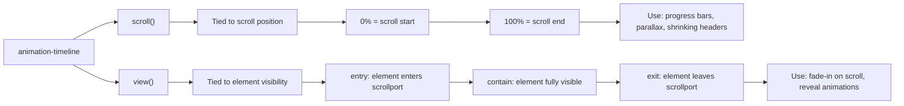

# Scroll — Replacing JavaScript Scroll Listeners

> Sources: [Scroll-Driven Animations Level 1](https://www.w3.org/TR/scroll-animations-1/), [CSS Conditional Rules Level 5](https://www.w3.org/TR/css-conditional-5/) (scroll-state queries), [CSS Overflow Level 5](https://www.w3.org/TR/css-overflow-5/) (scroll markers/buttons), [MDN: Scroll-Driven Animations](https://developer.mozilla.org/en-US/docs/Web/CSS/CSS_scroll-driven_animations), [CSS Wrapped 2025](https://chrome.dev/css-wrapped-2025/).

---

## Why This Exists

Every `addEventListener('scroll', ...)` creates a main-thread bottleneck. Scroll listeners fire at 60-120Hz, force layout recalculations, and cause jank. CSS scroll-driven animations run on the compositor thread at zero JavaScript cost.

Two timeline types map animation progress to a physical scroll property instead of wall-clock time:

- **`scroll()`** — progress maps to the scroll position of a container (0% at top, 100% at bottom).
- **`view()`** — progress maps to the visibility of an element within a scrollport (0% when entering, 100% when exiting).



Scroll-driven animations are **Baseline**. Use freely.

---

## `scroll()` — Scroll Progress Timeline

Maps animation progress to the scroll position of a container. At scroll start, progress is 0%. At scroll end, 100%.

### Core Pattern: Reading Progress Bar

```css
/* ❌ JavaScript — main-thread scroll listener */
```
```javascript
const bar = document.querySelector('.progress-bar');
window.addEventListener('scroll', () => {
  const pct = window.scrollY / (document.body.scrollHeight - window.innerHeight);
  bar.style.width = `${pct * 100}%`;
});
```
```css
/* ✅ CSS — compositor-thread, zero JavaScript */
.progress-bar {
  position: fixed;
  inset-block-start: 0;
  inset-inline-start: 0;
  block-size: 3px;
  background: oklch(0.55 0.2 260);
  transform-origin: left;
  animation: grow-progress linear both;
  animation-timeline: scroll();
}

@keyframes grow-progress {
  from { scale: 0 1; }
  to   { scale: 1 1; }
}
```

### `scroll()` Parameters

```css
animation-timeline: scroll();                /* nearest ancestor, block axis */
animation-timeline: scroll(root);            /* document viewport */
animation-timeline: scroll(root inline);     /* document, horizontal axis */
animation-timeline: scroll(self);            /* element itself as scroller */
```

Parameters: **scroller** (`nearest`, `root`, `self`) and **axis** (`block`, `inline`, `x`, `y`). Both optional. Order does not matter.

### Named Scroll Timelines

When the animated element is not inside the scroll container, use a named timeline.

```css
.scroll-container {
  overflow-y: auto;
  scroll-timeline: --page-scroll block;
}

.floating-indicator {
  position: fixed;
  animation: slide-in linear both;
  animation-timeline: --page-scroll;
}

@keyframes slide-in {
  from { translate: -100% 0; }
  to   { translate: 0 0; }
}
```

Named timeline names must start with `--` (like custom properties).

### Scenario: Parallax

```css
/* ❌ JavaScript — jank, layout thrashing */
```
```javascript
window.addEventListener('scroll', () => {
  const y = window.scrollY;
  bg.style.transform = `translateY(${y * 0.3}px)`;
});
```
```css
/* ✅ CSS — smooth, compositor-only */
.parallax-layer {
  animation: parallax-shift linear both;
  animation-timeline: scroll(root);
}

@keyframes parallax-shift {
  from { translate: 0 0; }
  to   { translate: 0 -30%; }
}
```

### Scenario: Shrinking Header on Scroll

```css
.site-header {
  position: sticky;
  inset-block-start: 0;
  animation: shrink-header linear both;
  animation-timeline: scroll(root);
  animation-range: 0px 200px; /* constrain to first 200px of scroll */
}

@keyframes shrink-header {
  from { padding-block: 2rem; font-size: 1.5rem; }
  to   { padding-block: 0.5rem; font-size: 1rem; }
}
```

### Critical: Firefox Duration Requirement

`animation-duration` is ignored with scroll timelines — scroll position controls progress. But **Firefox requires a non-zero value** for the animation to apply:

```css
.element {
  animation: my-anim linear both;
  animation-timeline: scroll();
  animation-duration: 1ms; /* Required by Firefox */
}
```

---

## `view()` — View Progress Timeline

Tracks an element's visibility within a scrollport. Replaces `IntersectionObserver` for visual effects.

### Core Pattern: Fade-In on Scroll

```css
/* ❌ JavaScript — IntersectionObserver setup */
```
```javascript
const observer = new IntersectionObserver((entries) => {
  entries.forEach(entry => {
    if (entry.isIntersecting) {
      entry.target.classList.add('visible');
      observer.unobserve(entry.target);
    }
  });
}, { threshold: 0.1 });
document.querySelectorAll('.reveal').forEach(el => observer.observe(el));
```
```css
/* ✅ CSS — declarative, no observer, no class toggling */
.reveal {
  animation: fade-in linear both;
  animation-timeline: view();
  animation-range: entry 0% cover 40%;
}

@keyframes fade-in {
  from { opacity: 0; translate: 0 50px; }
  to   { opacity: 1; translate: 0 0; }
}
```

### `view()` Parameters

```css
animation-timeline: view();              /* block axis (vertical) */
animation-timeline: view(inline);        /* inline axis (horizontal) */
animation-timeline: view(block 20px);    /* with inset — shrink detection area */
```

Parameters: **axis** (`block`, `inline`, `x`, `y`) and **inset** (shrinks scrollport for detection). Both optional.

### `animation-range` — When the Animation Plays

This is the most important property for `view()` timelines. It defines which portion of the timeline drives animation progress.

```
Timeline phases for view():
┌──────────┬──────────┬──────────┬──────────┬──────────┐
│  entry   │ entry-   │ contain  │  exit-   │  exit    │
│          │ crossing │          │ crossing │          │
│ Starts   │ Crosses  │ Fully    │ Crosses  │ Fully    │
│ entering │ into     │ visible  │ out of   │ exited   │
└──────────┴──────────┴──────────┴──────────┴──────────┘
  0%                    50%                        100%
```

```css
animation-range: entry 0% cover 50%;     /* first pixel to fully inside */
animation-range: entry;                   /* entry phase only */
animation-range: exit;                    /* exit phase only */
animation-range: entry 25% exit 75%;     /* 25% entered to 75% exited */
```

### Named View Timelines

When the animated element differs from the tracked element, use a named timeline.

```css
.tracked-section {
  view-timeline: --section-reveal block;
}

.tracked-section .content {
  animation: slide-up linear both;
  animation-timeline: --section-reveal;
  animation-range: entry 0% contain 30%;
}

@keyframes slide-up {
  from { opacity: 0; translate: 0 40px; }
  to   { opacity: 1; translate: 0 0; }
}
```

### Scenario: Image Scale-Up on Scroll

```css
.hero-image {
  animation: scale-in linear both;
  animation-timeline: view();
  animation-range: entry 0% contain 50%;
}

@keyframes scale-in {
  from { scale: 0.8; opacity: 0.5; }
  to   { scale: 1; opacity: 1; }
}
```

---

## Scroll-State Container Queries

Boolean state detection for scroll-related properties. Unlike scroll-driven animations (which map progress to a timeline), these toggle discrete states.

**Feature-detect with `@supports (container-type: scroll-state)`.**

**CRITICAL RULE**: The styled element must be a **child** of the scroll-state container. You cannot style the container itself. This is the same child-only rule as size container queries.

```css
/* WRONG — styles the container itself */
.header { container-type: scroll-state; }
@container scroll-state(stuck: top) {
  .header { box-shadow: ...; } /* FAILS */
}

/* RIGHT — styles a child */
.header { container-type: scroll-state; }
@container scroll-state(stuck: top) {
  .header-inner { box-shadow: ...; } /* WORKS */
}
```

### `stuck` — Sticky Header Shadow

Detects when `position: sticky` is stuck to a scroll edge. Replaces sentinel-based `IntersectionObserver` hacks.

```css
/* ❌ JavaScript — sentinel element + IntersectionObserver */
```
```javascript
const sentinel = document.createElement('div');
header.parentNode.insertBefore(sentinel, header);
const observer = new IntersectionObserver(([e]) => {
  header.classList.toggle('stuck', !e.isIntersecting);
}, { threshold: [1] });
observer.observe(sentinel);
```
```css
/* ✅ CSS — no sentinel, no observer */
.sticky-header {
  position: sticky;
  inset-block-start: 0;
  container-type: scroll-state;
}

@container scroll-state(stuck: top) {
  .sticky-header-content {
    box-shadow: 0 2px 8px oklch(0 0 0 / 0.15);
    border-block-end: 1px solid oklch(0.85 0 0);
    backdrop-filter: blur(8px);
  }
}
```

Values: `top`, `bottom`, `inset-block-start`, `inset-block-end`, `inset-inline-start`, `inset-inline-end`, `none`.

### `snapped` — Carousel Item Highlighting

Detects the current snap target. Use `not scroll-state(snapped: ...)` to dim non-active items.

```css
.carousel {
  display: flex;
  overflow-x: auto;
  scroll-snap-type: x mandatory;
}

.carousel-item {
  scroll-snap-align: center;
  container-type: scroll-state;
}

@container not scroll-state(snapped: x) {
  .carousel-item-content {
    opacity: 0.4;
    scale: 0.95;
    transition: opacity 0.3s, scale 0.3s;
  }
}

@container scroll-state(snapped: x) {
  .carousel-item-content {
    opacity: 1;
    scale: 1;
  }
}
```

Values: `x`, `y`, `block`, `inline`, `none`.

### `scrollable` — Overflow Indicators

Show/hide scroll affordances based on whether content overflows.

```css
.scrollable-area {
  overflow-x: auto;
  container-type: scroll-state;
}

@container scroll-state(scrollable: right) {
  .scroll-hint-end {
    display: block;
    background: linear-gradient(to left, oklch(0.98 0 0), transparent);
  }
}

@container not scroll-state(scrollable: right) {
  .scroll-hint-end { display: none; }
}
```

Values: `top`, `bottom`, `left`, `right`, `inset-block-start`, `inset-block-end`, `inset-inline-start`, `inset-inline-end`, `none`.

### `scrolled` — Hide-on-Scroll Headers

Detects whether a container has been scrolled from its initial position.

```css
.page-wrapper {
  container-type: scroll-state;
}

@container scroll-state(scrolled: top) {
  .auto-hide-header {
    translate: 0 -100%;
    transition: translate 0.3s ease;
  }
  .back-to-top {
    opacity: 1;
    pointer-events: auto;
  }
}

@container not scroll-state(scrolled: top) {
  .auto-hide-header {
    translate: 0 0;
    transition: translate 0.3s ease;
  }
}
```

Values: `top`, `bottom`, `left`, `right`, `inset-block-start`, `inset-block-end`, `inset-inline-start`, `inset-inline-end`, `none`.

---

## Native CSS Carousels

Built-in pseudo-elements for carousel controls. The browser generates accessible prev/next buttons and pagination markers natively — no JavaScript, no ARIA wiring. Keyboard navigation, screen reader announcements, and focus management are automatic.

**Feature-detect with `@supports selector(::scroll-button(inline-start))`.**

### `::scroll-button()` — Prev/Next Navigation

Generates buttons that scroll the container by one page. Only created when `content` is set to a non-`none` value. Auto-disabled at scroll boundaries.

```css
.carousel {
  display: flex;
  overflow-x: auto;
  scroll-snap-type: x mandatory;
}

.carousel > * {
  scroll-snap-align: start;
  flex: 0 0 100%;
}

.carousel::scroll-button(inline-start) { content: '\2190'; }
.carousel::scroll-button(inline-end)   { content: '\2192'; }

.carousel::scroll-button(*) {
  background: oklch(0.2 0 0 / 0.7);
  color: oklch(0.98 0 0);
  border: none;
  border-radius: 50%;
  inline-size: 3rem;
  block-size: 3rem;
  cursor: pointer;
}

.carousel::scroll-button(*):disabled { opacity: 0.3; cursor: default; }
.carousel::scroll-button(*):focus-visible {
  outline: 2px solid oklch(0.55 0.2 260);
  outline-offset: 2px;
}
```

Direction arguments: `inline-start`, `inline-end`, `block-start`, `block-end`, `up`, `down`, `left`, `right`, `*` (all). Buttons automatically get `role="button"` and accessible names ("scroll left", "scroll right").

### `::scroll-marker` — Pagination Dots

Generated on each child of the scroll container. Creates clickable indicators that scroll to the associated item. `:target-current` matches the currently scrolled-to item's marker.

```css
.carousel {
  overflow-x: auto;
  scroll-snap-type: x mandatory;
  scroll-marker-group: after; /* markers after content */
}

.carousel::scroll-marker-group {
  display: flex;
  gap: 0.5rem;
  justify-content: center;
  padding-block: 1rem;
}

.carousel > *::scroll-marker {
  content: '';
  inline-size: 12px;
  block-size: 12px;
  border-radius: 50%;
  background: oklch(0.75 0 0);
  cursor: pointer;
}

.carousel > *::scroll-marker:target-current {
  background: oklch(0.45 0.2 260);
}
```

`scroll-marker-group` values: `after` (below/after content), `before` (above/before).

### Scroll-Spy with `scroll-marker-group: before`

Use markers as a table-of-contents. The marker for the currently visible section highlights automatically.

```css
.page-content {
  overflow-y: auto;
  scroll-snap-type: y proximity;
  scroll-marker-group: before;
}

.page-content::scroll-marker-group {
  display: flex;
  gap: 1rem;
  padding: 1rem;
  position: sticky;
  inset-block-start: 0;
  background: oklch(0.98 0 0);
  z-index: 10;
}

.page-content > section { scroll-snap-align: start; }

.page-content > section::scroll-marker {
  content: attr(data-label);
  padding: 0.5rem 1rem;
  border-radius: 2rem;
  background: oklch(0.95 0 0);
}

.page-content > section::scroll-marker:target-current {
  background: oklch(0.45 0.2 260);
  color: oklch(0.98 0 0);
}
```

---

## `scrollend` Event

Native event when scrolling completes. Fires once, after all momentum and snap settling. Replaces debounced scroll listeners. Part of **Interop 2025**.

```javascript
// ❌ Old: debounced scroll listener
let timeout;
container.addEventListener('scroll', () => {
  clearTimeout(timeout);
  timeout = setTimeout(() => { /* ... */ }, 150);
});

// ✅ New: native scrollend
container.addEventListener('scrollend', () => {
  // fires once, after snap settling
});
```

Fires on: finger lift, mousewheel stop, keyboard scroll end, `scrollTo()` completion, fling momentum end. Does NOT fire when scroll position is unchanged or no overflow exists.

Related: `scrollsnapchange` (after snap target changes) and `scrollsnapchanging` (during snap transition) — limited cross-browser support.

---

## Accessibility

### The Universal Opt-Out Pattern

Wrap ALL scroll-driven animations in a motion preference query. No exceptions.

```css
@media (prefers-reduced-motion: no-preference) {
  .reveal {
    animation: fade-in linear both;
    animation-timeline: view();
    animation-range: entry 0% cover 40%;
  }

  .parallax-layer {
    animation: parallax linear both;
    animation-timeline: scroll(root);
  }
}

@media (prefers-reduced-motion: reduce) {
  .reveal { opacity: 1; } /* ensure content visible without animation */
}
```

### What Does NOT Need Motion Wrapping

- Scroll-state queries (`stuck`, `snapped`, `scrollable`, `scrolled`) -- toggle static visual states, not animations.
- `::scroll-button()` and `::scroll-marker` -- navigation controls, not motion effects.
- `scrollend` handlers -- respond after scrolling, not during.

### Native Carousel Accessibility

`::scroll-button()` automatically receives: implicit `role="button"`, accessible direction names, keyboard focusability, auto-disable at boundaries. `::scroll-marker` automatically receives: grouping semantics, active state announcement, keyboard navigation between markers. Do NOT manually add ARIA attributes to these pseudo-elements.

> For non-Baseline features, always feature-detect with `@supports` or use progressive enhancement. Check [MDN](https://developer.mozilla.org/en-US/docs/Web/CSS) or [Baseline](https://web.dev/baseline) for current browser support.
